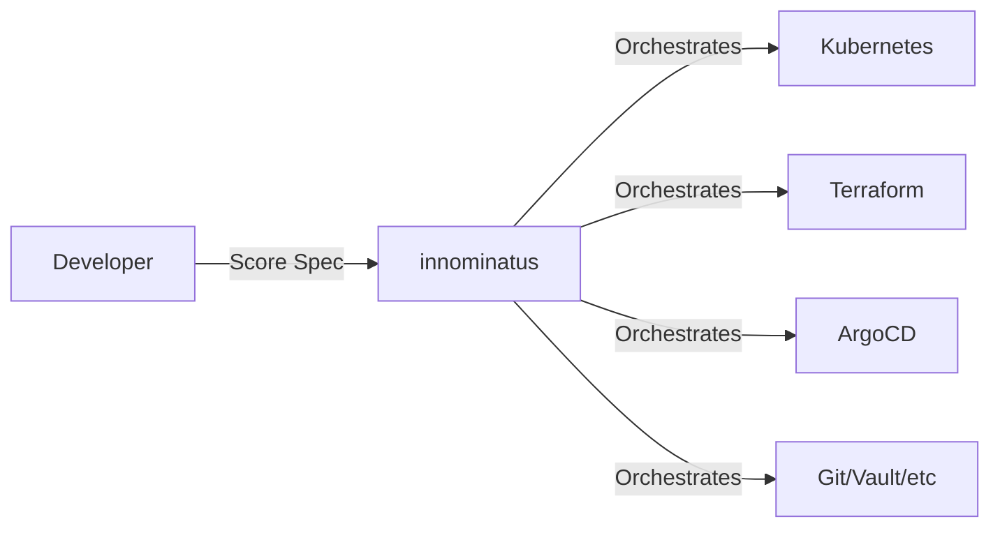

# Quick Win 1: README.md Persona Split

**Effort:** 1 Tag
**Impact:** CRITICAL - Sofort 80% weniger Confusion
**ROI:** Sehr hoch

---

## Aufgabe

Baue die README.md um, sodass sie **in den ersten 100 Zeilen** eine klare Persona-Auswahl bietet.

## Kontext

**Problem:**
Aktuell vermischt README.md zwei völlig unterschiedliche Zielgruppen:
- Platform Team (will innominatus BETREIBEN)
- Platform User (will innominatus NUTZEN)

Developer lesen "Build from Source" und denken "zu komplex" → geben auf.
Dabei müssen sie das GAR NICHT - Platform Team hat schon alles aufgesetzt!

**Ziel:**
User sieht sofort: "Dein Platform Team hat das schon aufgesetzt, du kannst direkt loslegen!"

## Konkrete Anforderungen

### 1. Hero Section (erste 50 Zeilen)

```markdown
# innominatus

**Score-based platform orchestration for enterprise Internal Developer Platforms**

> A workflow orchestration component that executes multi-step deployments from Score specifications. Built for platform teams, used by developers.

---

## 👋 Choose Your Path

<table>
<tr>
<td width="50%" valign="top">

### 🧑‍💻 I'm a Developer

**I want to deploy my applications**

Your Platform Team has set up innominatus for you!

**What you need:**
- ✅ Access to your company's innominatus platform
- ✅ API credentials
- ✅ The CLI tool

**Get started:**
→ **[User Guide](docs/user-guide/README.md)** - Deploy your first app in 5 minutes

</td>
<td width="50%" valign="top">

### ⚙️ I'm a Platform Engineer

**I want to set up innominatus for my organization**

You're building an Internal Developer Platform.

**What you need:**
- ✅ Kubernetes cluster
- ✅ PostgreSQL database
- ✅ Helm knowledge

**Get started:**
→ **[Platform Team Guide](docs/platform-team-guide/README.md)** - Install and operate innominatus

</td>
</tr>
</table>

---

## Live Demo

Try innominatus without installation:
→ https://demo.innominatus.dev (coming soon)

---
```

### 2. Overview Section (kompakt halten)

```markdown
## What is innominatus?

innominatus orchestrates complex deployment workflows from [Score specifications](https://score.dev).

**Core Value:**
- **For Platform Teams:** Centralized workflow orchestration with audit trails
- **For Developers:** Self-service deployment via simple Score specs
- **For Organizations:** Standardized golden paths with compliance built-in

### How it Works



**Example:** Deploy app with database and monitoring in one command:
```bash
innominatus-ctl deploy my-app.yaml
# → Creates: Namespace, Database, Deployment, Ingress, Monitoring
```

---
```

### 3. Features Section (fokussiert)

```markdown
## Key Features

### For Developers (Platform Users)
- ✅ **Simple Score Specs** - Declare what you need, not how to provision it
- ✅ **Golden Paths** - Pre-defined workflows for common use cases
- ✅ **Self-Service** - Deploy without waiting for Platform Team
- ✅ **Visibility** - Real-time status, logs, and workflow history

### For Platform Teams
- ✅ **Multi-Step Workflows** - Kubernetes, Terraform, Ansible, ArgoCD, Git ops
- ✅ **Database Persistence** - Full audit trails and workflow history
- ✅ **RESTful API** - Integrate with Backstage, CNOE, custom IDPs
- ✅ **Enterprise Ready** - RBAC, OIDC, metrics, HA deployment

---
```

### 4. Quick Links (für schnelle Navigation)

```markdown
## Documentation

| For Developers | For Platform Teams | For Contributors |
|----------------|-------------------|------------------|
| [Getting Started](docs/user-guide/getting-started.md) | [Installation](docs/platform-team-guide/installation.md) | [Contributing](CONTRIBUTING.md) |
| [Deploy Your First App](docs/user-guide/first-deployment.md) | [Configuration](docs/platform-team-guide/configuration.md) | [Building from Source](docs/development/building.md) |
| [CLI Reference](docs/user-guide/cli-reference.md) | [Operations Guide](docs/platform-team-guide/operations.md) | [Architecture](docs/development/architecture.md) |
| [Troubleshooting](docs/user-guide/troubleshooting.md) | [Monitoring & Alerts](docs/platform-team-guide/monitoring.md) | [Testing](docs/development/testing.md) |

---
```

### 5. Support Section

```markdown
## Getting Help

**Platform Users:**
- First, contact your Platform Team (they set up innominatus for you)
- Check [User Troubleshooting Guide](docs/user-guide/troubleshooting.md)

**Platform Teams:**
- [Platform Operations Guide](docs/platform-team-guide/operations.md)
- [GitHub Discussions](https://github.com/philipsahli/innominatus/discussions)
- [GitHub Issues](https://github.com/philipsahli/innominatus/issues)

**Contributors:**
- [Contributing Guide](CONTRIBUTING.md)
- [Development Setup](docs/development/setup.md)

---
```

### 6. Rest der README

Behalte den Rest (License, Built by, etc.) aber **ENTFERNE oder VERSCHIEBE**:
- ❌ "Build from Source" → Move to `docs/development/building.md`
- ❌ "Installation" → Move to `docs/platform-team-guide/installation.md`
- ❌ "Database Configuration" → Move to `docs/platform-team-guide/database.md`
- ❌ Alle technischen Details → In jeweilige Guides

## Was zu LÖSCHEN ist aus README.md

```markdown
# DIESE SECTIONS RAUS (in andere Docs verschieben):

## Prerequisites ← DELETE (zu technisch für README)
## Build from Source ← DELETE (move to docs/development/)
## Docker Image ← DELETE (move to docs/platform-team-guide/)
## Kubernetes Deployment ← DELETE (move to docs/platform-team-guide/)
## Production Setup ← DELETE (move to docs/platform-team-guide/)
## Database Configuration ← DELETE (move to docs/platform-team-guide/)
## Secrets Management ← DELETE (move to docs/platform-team-guide/)
## Scaling & HA ← DELETE (move to docs/platform-team-guide/)
```

README sollte **NUR** enthalten:
1. Hero Section mit Persona-Auswahl
2. "What is innominatus?" (2-3 Absätze)
3. Features (kompakt)
4. Quick Links zu Docs
5. Support
6. License

**Maximale Länge: 300 Zeilen** (aktuell ~870 Zeilen!)

## Acceptance Criteria

✅ README.md startet mit klarer Persona-Auswahl
✅ Developer sieht sofort: "Platform Team has set up for you"
✅ Platform Team sieht sofort: "Installation Guide"
✅ Contributor sieht sofort: "Contributing Guide"
✅ Keine technischen Details in README (nur in verlinkten Guides)
✅ README ist max 300 Zeilen lang
✅ Mermaid Diagramm zeigt klare Architektur
✅ Alle Links funktionieren (auch wenn Ziel-Docs noch nicht existieren - erstelle Placeholder)

## Files zu ändern

1. `README.md` - Komplettes Rewrite der ersten 300 Zeilen
2. `docs/user-guide/README.md` - Erstelle Placeholder falls nicht existiert
3. `docs/platform-team-guide/README.md` - Erstelle Placeholder falls nicht existiert
4. `docs/development/README.md` - Erstelle Placeholder falls nicht existiert

## Testing

Nach dem Rewrite, simuliere diese User Journeys:

**Journey 1: Developer (never used innominatus)**
- Öffnet README.md
- Sieht: "I'm a Developer" → Klickt
- Landet in User Guide
- ✅ Erwartet: "Your Platform Team has set up..." → Beruhigt
- ✅ Erwartet: "Step 1: Get credentials" → Klar was zu tun ist

**Journey 2: Platform Team (wants to set up innominatus)**
- Öffnet README.md
- Sieht: "I'm Platform Engineer" → Klickt
- Landet in Platform Team Guide
- ✅ Erwartet: "Prerequisites: Kubernetes, PostgreSQL..." → Klar was nötig ist
- ✅ Erwartet: "Installation with Helm" → Schnelle Installation

**Journey 3: Contributor (wants to contribute)**
- Öffnet README.md
- Sieht: "Contributing" Link
- Landet in Contributing Guide
- ✅ Erwartet: "Build from Source" → Weiß wie zu starten

## Success Metrics

**Vorher:**
- ❌ Developer liest "Build from Source" → Verwirrung
- ❌ 870 Zeilen README → Information Overload
- ❌ Keine klare Persona-Trennung

**Nachher:**
- ✅ Developer sieht sofort "Platform Team has set up" → Klarheit
- ✅ ~300 Zeilen README → Fokussiert
- ✅ Klare Persona-Auswahl in ersten 50 Zeilen

## Beispiel Output

Nach diesem Prompt sollte die README.md starten mit:

```markdown
# innominatus

**Score-based platform orchestration for enterprise Internal Developer Platforms**

> A workflow orchestration component that executes multi-step deployments...

---

## 👋 Choose Your Path

[TABLE with Developer vs Platform Engineer]

---

## What is innominatus?

innominatus orchestrates complex deployment workflows...

[MERMAID diagram]

---

## Key Features

### For Developers
- ✅ Simple Score Specs
...

### For Platform Teams
- ✅ Multi-Step Workflows
...

---

## Documentation

[Quick Links Table]

---

## Getting Help
...

---

## License
...
```

**Maximale Länge: 300 Zeilen**
**Fokus: Klarheit über Vollständigkeit**

---

## Additional Context

Siehe auch:
- `DEVEX_ANALYSIS-DOCUMENTATION_STRUCTURE-2025-10-05.md` - Vollständige Analyse
- `DEVEX_ANALYSIS-2025-10-05.md` - DevEx Probleme
- Aktuelle `README.md` - Was zu ändern ist
