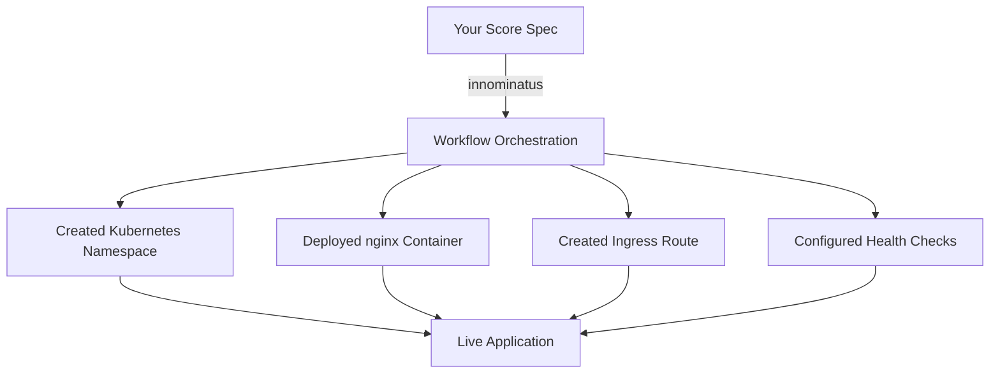

# Quick Win 2: User Guide - Getting Started

**Effort:** 1 Tag
**Impact:** HIGH - Ermöglicht ersten erfolgreichen Deployment
**ROI:** Sehr hoch

---

## Aufgabe

Erstelle einen vollständigen "Getting Started" Guide für **Platform Users** (Developers).

## Kontext

**Zielgruppe:** Developer in einem Team, dessen Platform Team innominatus bereits aufgesetzt hat.

**User-Persona:**
- Name: Sarah, Senior Backend Developer
- Team: Product Team (5 Developers)
- Skills: Docker, Basic Kubernetes, Git
- Ziel: Node.js App mit PostgreSQL deployen
- Zeitbudget: 15 Minuten bis zum ersten Success

**Aktuelle Situation:**
- Platform Team hat innominatus installiert unter: `https://platform.company.com`
- Sarah hat Zugang zu company portal
- Sarah will NICHT wissen wie PostgreSQL funktioniert
- Sarah will einfach deployen

## Dateistruktur

Erstelle:

```
docs/user-guide/
├── README.md
├── getting-started.md          ← DIESER PROMPT
├── first-deployment.md
├── cli-reference.md
└── troubleshooting.md
```

## Inhalt: getting-started.md

### Section 1: Welcome (motivierend)

```markdown
# Getting Started with innominatus

Welcome! 👋

Your Platform Team has set up **innominatus** - a platform that makes deploying applications simple and consistent.

## What You'll Learn

In the next 15 minutes, you'll:

1. ✅ Connect to your company's innominatus platform
2. ✅ Install the CLI tool
3. ✅ Deploy your first application
4. ✅ See it running live

**No Kubernetes knowledge required. No infrastructure setup needed.**

Let's get started! 🚀

---
```

### Section 2: Prerequisites (minimal)

```markdown
## Prerequisites

✅ You have access to your company's internal network
✅ You can install command-line tools on your laptop
✅ You have a terminal/command prompt

**That's it!** Your Platform Team has set up everything else.

---
```

### Section 3: Step 1 - Get Platform Access

```markdown
## Step 1: Get Platform Access (2 minutes)

### Find Your Platform URL

Your Platform Team operates innominatus at a specific URL.

**Common patterns:**
- `https://platform.company.com`
- `https://innominatus.company.com`
- `https://idp.company.com`

**Where to find it:**
1. Check your company's internal wiki/docs
2. Ask in Slack: `#platform-support` or `#devops`
3. Ask your Tech Lead

**Save it for later:**
```bash
export INNOMINATUS_URL="https://platform.company.com"
```

### Get Your Credentials

You need an API key to deploy applications.

**Option A: Self-Service Portal (if available)**
1. Go to your company's developer portal
2. Navigate to: API Keys → innominatus
3. Click "Generate API Key"
4. Copy the key

**Option B: Request from Platform Team**
1. Slack: `#platform-support`
2. Message: "Hi! I need innominatus API access for deploying my app. My team: [YOUR_TEAM]"
3. Platform Team will provide an API key

**Save your API key:**
```bash
export IDP_API_KEY="your-api-key-here"
```

> 💡 **Tip:** Add this to your `~/.bashrc` or `~/.zshrc` so you don't have to set it every time.

✅ **Checkpoint:** You have the platform URL and an API key

---
```

### Section 4: Step 2 - Install CLI

```markdown
## Step 2: Install the CLI (2 minutes)

The CLI tool lets you deploy applications from your terminal.

### macOS

```bash
# Using Homebrew
brew install innominatus-cli

# Or download directly
curl -L https://github.com/philipsahli/innominatus/releases/latest/download/innominatus-ctl-darwin-arm64 -o /usr/local/bin/innominatus-ctl
chmod +x /usr/local/bin/innominatus-ctl
```

### Linux

```bash
# Download
curl -L https://github.com/philipsahli/innominatus/releases/latest/download/innominatus-ctl-linux-amd64 -o /usr/local/bin/innominatus-ctl
chmod +x /usr/local/bin/innominatus-ctl
```

### Windows

Download from: https://github.com/philipsahli/innominatus/releases/latest

Or use WSL2 and follow Linux instructions.

### Verify Installation

```bash
innominatus-ctl --version
```

You should see:
```
innominatus-ctl version 1.0.0
```

### Configure CLI

Point the CLI to your company's platform:

```bash
# Set platform URL
innominatus-ctl config set server $INNOMINATUS_URL

# Verify connection
innominatus-ctl ping
```

Expected output:
```
✓ Connected to innominatus at https://platform.company.com
✓ Authentication successful
✓ Platform version: 1.0.0
```

✅ **Checkpoint:** CLI is installed and connected

---
```

### Section 5: Step 3 - First Deployment (THE KEY MOMENT!)

```markdown
## Step 3: Deploy Your First Application (5 minutes)

Let's deploy a simple web application to verify everything works.

### Create a Score Specification

Create a file called `hello-world.yaml`:

```yaml
apiVersion: score.dev/v1b1

metadata:
  name: hello-world

containers:
  web:
    image: nginx:latest
    ports:
      - name: http
        port: 80
        protocol: TCP

resources:
  route:
    type: route
    params:
      host: hello-world.company.com  # Replace with your domain
      port: 80
```

**What this does:**
- Deploys an nginx web server
- Creates an ingress route
- Makes it accessible at `hello-world.company.com`

### Deploy It!

```bash
innominatus-ctl deploy hello-world.yaml
```

**What you'll see:**

```
🚀 Starting deployment: hello-world

Workflow: deploy-app (6 steps)
═══════════════════════════════════════

[1/6] ✓ validate-spec          (0.5s)
      Validating Score specification...
      ✓ Valid

[2/6] ✓ create-namespace        (1.2s)
      Creating Kubernetes namespace: hello-world
      ✓ Namespace created

[3/6] ✓ provision-resources     (2.1s)
      Creating ingress route...
      ✓ Route configured

[4/6] ✓ deploy-application      (3.8s)
      Deploying container: nginx:latest
      ✓ Deployment successful

[5/6] ✓ health-check            (2.3s)
      Waiting for pods to be ready...
      ✓ 1/1 pods healthy

[6/6] ✓ register-application    (0.4s)
      Registering with platform...
      ✓ Registered

═══════════════════════════════════════
✅ Deployment completed successfully!
⏱  Total time: 10.3 seconds

🌐 Your application is available at:
   https://hello-world.company.com

📊 View status:    innominatus-ctl status hello-world
📝 View logs:      innominatus-ctl logs hello-world
🗑️  Delete app:     innominatus-ctl delete hello-world
```

### Verify It Works

Open in browser:
```bash
open https://hello-world.company.com
```

You should see the nginx welcome page! 🎉

✅ **SUCCESS!** You just deployed your first application with innominatus!

---
```

### Section 6: Understanding What Happened

```markdown
## What Just Happened?

Let's break down what innominatus did for you:



**Key Points:**

1. **You wrote:** Simple Score spec (10 lines of YAML)
2. **innominatus did:**
   - Created Kubernetes namespace
   - Generated deployment manifests
   - Set up networking/ingress
   - Configured health checks
   - Registered app in platform

3. **You didn't need to:**
   - Know Kubernetes internals
   - Write deployment YAML
   - Configure kubectl
   - Set up ingress controllers
   - Manage namespaces

**This is the power of a platform!** ✨

---
```

### Section 7: Common Commands

```markdown
## Essential Commands

Now that you have an app deployed, here are commands you'll use daily:

### Check Application Status

```bash
innominatus-ctl status hello-world
```

Output:
```
Application: hello-world
Status: Running ✓
Deployed: 2 minutes ago
Replicas: 1/1 healthy
Resources:
  - route: hello-world.company.com (active)
URL: https://hello-world.company.com
```

### View Logs

```bash
# Recent logs
innominatus-ctl logs hello-world

# Follow logs (live)
innominatus-ctl logs hello-world --follow

# Last 100 lines
innominatus-ctl logs hello-world --tail 100
```

### List Your Applications

```bash
innominatus-ctl list
```

Output:
```
NAME            STATUS      AGE         URL
hello-world     Running     5m ago      https://hello-world.company.com
```

### Update Application

Edit `hello-world.yaml`, then:

```bash
innominatus-ctl deploy hello-world.yaml
```

innominatus will update your deployment with zero downtime.

### Delete Application

```bash
innominatus-ctl delete hello-world
```

This removes:
- The deployment
- The namespace
- All resources
- DNS entries

---
```

### Section 8: Next Steps

```markdown
## Next Steps

🎉 **Congratulations!** You've successfully:
- ✅ Connected to your platform
- ✅ Installed the CLI
- ✅ Deployed your first application
- ✅ Verified it's running

### What's Next?

**Deploy a Real Application:**
→ [Deploy Node.js App with PostgreSQL](../recipes/nodejs-postgres.md)

**Learn About Golden Paths:**
→ [Understanding Golden Paths](../guides/golden-paths.md)

**Explore More Features:**
- [Managing Secrets](../guides/secrets.md)
- [Multi-Environment Deployments](../guides/environments.md)
- [Monitoring Your Apps](../guides/monitoring.md)

**Get Help:**
- 💬 Slack: `#platform-support`
- 📧 Email: `platform-team@company.com`
- 📚 [Troubleshooting Guide](troubleshooting.md)

---
```

### Section 9: Troubleshooting (Quick Fixes)

```markdown
## Quick Troubleshooting

### CLI Can't Connect to Platform

**Error:** `Error: connection refused`

**Fix:**
```bash
# Verify URL is correct
echo $INNOMINATUS_URL

# Test connection
curl $INNOMINATUS_URL/health

# If on VPN, verify you're connected
```

### Authentication Failed

**Error:** `Error: 401 Unauthorized`

**Fix:**
```bash
# Verify API key is set
echo $IDP_API_KEY

# Check if key is valid (ask Platform Team)
# Generate new key if needed
```

### Deployment Failed

**Error:** `Error: workflow execution failed at step X`

**Fix:**
```bash
# Get detailed logs
innominatus-ctl logs <workflow-id> --verbose

# Check status
innominatus-ctl status your-app

# Get help from Platform Team with:
# - Your app name
# - The error message
# - Workflow ID
```

### Need More Help?

→ [Full Troubleshooting Guide](troubleshooting.md)

---

**Time to Success:** 15 minutes ✓

**You're ready to deploy real applications!** 🚀
```

## Acceptance Criteria

✅ Guide startet mit "Your Platform Team has set up..."
✅ Klare Schritte mit Zeitangaben (Step 1: 2 min, Step 2: 2 min, etc.)
✅ Erster Deployment funktioniert (hello-world)
✅ "SUCCESS!" Moment ist klar und motivierend
✅ Mermaid Diagramm erklärt was passiert ist
✅ Nächste Schritte sind klar verlinkt
✅ Quick Troubleshooting für häufigste Probleme
✅ Kein Kubernetes-Jargon (namespace ok, aber erklärt)
✅ Screenshots/Output-Beispiele für jeden Schritt
✅ Maximal 15 Minuten Time-to-Success

## Additional Files

Erstelle auch Placeholder für:

1. `docs/user-guide/README.md`:
```markdown
# User Guide

Documentation for developers using innominatus.

- [Getting Started](getting-started.md) - Start here!
- [First Deployment](first-deployment.md)
- [CLI Reference](cli-reference.md)
- [Troubleshooting](troubleshooting.md)
```

2. `docs/user-guide/first-deployment.md`:
```markdown
# Your First Real Deployment

(Coming soon - will cover Node.js + PostgreSQL deployment)
```

## Testing

Nach Erstellung, simuliere Sarah's Journey:

**Sarah's Test:**
1. Öffnet getting-started.md
2. Liest ersten Abschnitt → "Oh, Platform Team hat schon alles!" ✓
3. Folgt Step 1 → Findet Platform URL, bekommt API Key ✓
4. Folgt Step 2 → Installiert CLI ✓
5. Folgt Step 3 → Deployed hello-world ✓
6. Sieht "SUCCESS!" → Motiviert! ✓
7. Klickt "Next Steps" → Weiß was als nächstes ✓

**Gesamt-Zeit:** <15 Minuten

## Success Metric

**Vorher:** User gibt auf nach 2 Stunden
**Nachher:** User hat Success nach 15 Minuten
