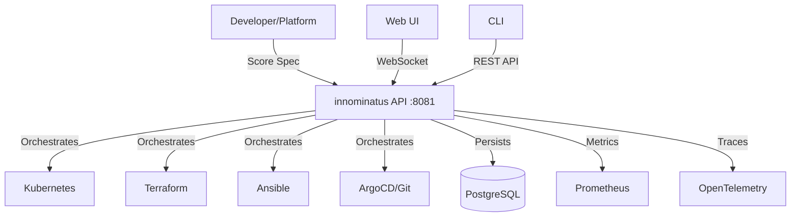

# innominatus - Quick Context Digest

**Project**: Score-based platform orchestration for enterprise Internal Developer Platforms
**Stack**: Go 1.24 (backend) + Next.js 15/TypeScript (web-ui) + PostgreSQL + Kubernetes
**Purpose**: Workflow orchestration component that executes multi-step deployments from Score specifications

## Architecture



## Current Focus

**Latest Work**: Workflow graph visualization (All Phases Complete - 14 features)
- Phase 1: Filtering, search, history ✓
- Phase 2: Real-time WebSocket updates, animations, annotations ✓
- Phase 3.1: Critical path analysis ✓
- Phase 3.2: Performance metrics ✓
- Phase 3.3: Historical graph comparison ✓

**Just Added**: Claude Code configuration (SOLID, KISS, YAGNI principles)

## Project Structure

```
innominatus/
├── cmd/
│   ├── server/main.go      # HTTP server entry point
│   └── cli/main.go         # CLI tool entry point
├── internal/
│   ├── server/             # HTTP handlers, routing, WebSocket
│   ├── database/           # PostgreSQL repositories (GORM)
│   ├── workflow/           # Workflow execution engine
│   └── auth/               # OIDC + API key authentication
├── web-ui/                 # Next.js 15 + TypeScript + Tailwind
│   ├── src/app/            # Next.js App Router pages
│   └── src/components/     # React components (graph viz, metrics, annotations)
├── migrations/             # Database schema migrations
├── workflows/              # Golden path templates (YAML)
├── .claude/                # AI assistant hooks and agents
├── verification/           # Verification-first development scripts
└── tests/                  # Integration and UI tests (Puppeteer)
```

## Key Files

- **CLAUDE.md** (880 lines) - Development guide with SOLID/KISS/YAGNI principles
- **README.md** - User-facing documentation and quickstart
- **go.mod** - Go dependencies (gorilla/websocket, GORM, Prometheus, OIDC)
- **goldenpaths.yaml** - Pre-defined workflow templates (deploy-app, ephemeral-env, db-lifecycle)
- **admin-config.yaml** - Platform-level configuration

## Quick Commands

```bash
# Build
go build -o innominatus cmd/server/main.go
go build -o innominatus-ctl cmd/cli/main.go
cd web-ui && npm run build

# Run
./innominatus                           # Server at http://localhost:8081
./innominatus-ctl run deploy-app app.yaml   # Execute golden path
cd web-ui && npm run dev                # Dev server at http://localhost:3000

# Test
go test ./...                           # Go unit tests
cd tests/ui && node graph-visualization.test.js  # UI tests

# Demo Environment
./innominatus-ctl demo-time             # Install complete platform (Gitea, ArgoCD, Vault, Grafana)
./innominatus-ctl demo-status           # Check health
./innominatus-ctl demo-nuke             # Clean up
```

## Development Principles

- **SOLID**: Single Responsibility, Open/Closed, Liskov Substitution, Interface Segregation, Dependency Inversion
- **KISS**: Simple > Clever, readable code, clear errors, avoid premature optimization
- **YAGNI**: Build what's needed, defer decisions, no speculative features
- **Verification-First**: Write test before code, iterate until verified

## Authentication

- **Local**: API keys in `users.yaml` (development)
- **Enterprise**: OIDC via Keycloak (production)
- **API Keys**: Database-backed, SHA-256 hashed, user-generated via Web UI

## API Endpoints (Server :8081)

- `GET /api/specs` - List Score specifications
- `POST /api/specs` - Deploy Score spec with embedded workflow
- `GET /api/graph/{app}` - Get workflow graph state
- `WS /api/graph/{app}/ws` - Real-time graph updates via WebSocket
- `GET /api/graph/{app}/history` - Workflow execution history
- `GET /api/graph/{app}/critical-path` - Critical path analysis
- `GET /api/graph/{app}/metrics` - Performance metrics
- `GET|POST|DELETE /api/graph/{app}/annotations` - Graph annotations
- `GET /health`, `/ready`, `/metrics` - Health and monitoring

## Recent Features

1. **Graph Visualization** (web-ui/src/components/graph-visualization.tsx)
   - D3.js-based workflow graph rendering
   - Real-time WebSocket updates (sub-100ms latency)
   - Filtering by type (spec, workflow, step, resource) and status
   - Search with fuzzy matching and yellow ring highlights
   - Critical path highlighting (purple ring)
   - Node/edge animations on state changes (blue ring)

2. **Performance Metrics** (internal/server/metrics.go)
   - Success/failure rates, duration statistics
   - Per-step performance breakdown
   - Time series data for trend analysis
   - Regression detection (>1s slower = warning)

3. **Historical Comparison** (web-ui/src/components/graph-diff.tsx)
   - Side-by-side snapshot comparison
   - Performance regression detection
   - Duration, status, and steps differences

4. **Annotations System** (internal/server/annotations.go)
   - Click-to-annotate graph nodes
   - Multi-user collaboration with user attribution
   - Real-time sync across sessions

## Contact Points

- **Platform Teams**: See docs/platform-team-guide/ for installation and operations
- **Developers**: See docs/user-guide/ for deployment workflows
- **Contributors**: See CONTRIBUTING.md and docs/development/

---

**Last Updated**: 2025-10-16
**Status**: Active development, v0.x.x pre-release
**License**: Apache 2.0
