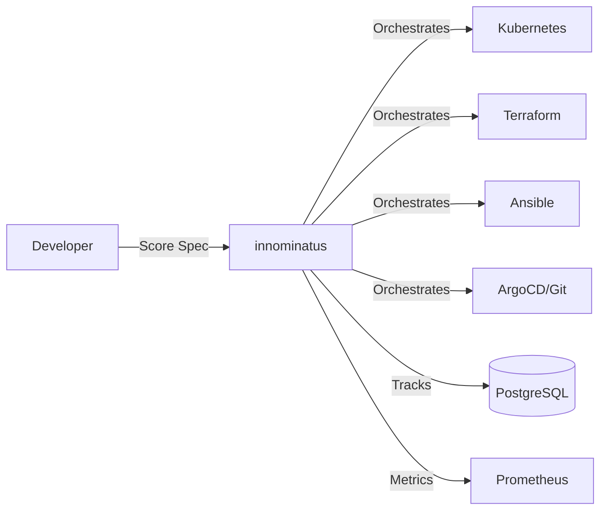

# innominatus

**Score-based platform orchestration for enterprise Internal Developer Platforms**

> A workflow orchestration component that executes multi-step deployments from Score specifications. Built for platform teams, used by developers.

[](https://codecov.io/github/philipsahli/innominatus) [](https://opensource.org/licenses/Apache-2.0) [](https://github.com/philipsahli/innominatus/actions/workflows/test.yml) [](https://github.com/philipsahli/innominatus/actions/workflows/security.yml)

---

## 👋 Choose Your Path

<table>
<tr>
<td width="50%" valign="top">

### 🧑‍💻 I'm a Developer

**I want to deploy my applications**

Your Platform Team has set up innominatus for you!

**What you need:**
- ✅ Access to your company's innominatus platform
- ✅ API credentials from your Platform Team
- ✅ The `innominatus-ctl` CLI tool

**Get started:**

→ **[User Guide](docs/user-guide/README.md)** - Deploy your first app in 5 minutes

</td>
<td width="50%" valign="top">

### ⚙️ I'm a Platform Engineer

**I want to set up innominatus for my organization**

You're building an Internal Developer Platform.

**What you need:**
- ✅ Kubernetes cluster
- ✅ PostgreSQL database
- ✅ OIDC provider (optional)

**Get started:**

→ **[Platform Team Guide](docs/platform-team-guide/README.md)** - Install and operate innominatus

</td>
</tr>
</table>

**Contributing?** → [Development Guide](docs/development/README.md) | [CONTRIBUTING.md](CONTRIBUTING.md)

---

## What is innominatus?

innominatus orchestrates complex deployment workflows from [Score specifications](https://score.dev).

**Core Value:**
- **For Platform Teams:** Centralized workflow orchestration with audit trails and observability
- **For Developers:** Self-service deployment via simple Score specs - no infrastructure knowledge required
- **For Organizations:** Standardized golden paths with compliance and governance built-in

### How it Works



**Example:** Deploy app with database and monitoring in one command:

```bash
innominatus-ctl deploy my-app.yaml
# → Creates: Namespace, Database, Deployment, Ingress, Monitoring
```

---

## Key Features

### For Developers (Platform Users)

- ✅ **Simple Score Specs** - Declare what you need, not how to provision it
- ✅ **Golden Paths** - Pre-defined workflows for common use cases (deploy, ephemeral environments, database lifecycle)
- ✅ **Self-Service** - Deploy without waiting for Platform Team approval
- ✅ **Visibility** - Real-time status, logs, and workflow history via Web UI or CLI
- ✅ **Modern CLI** - Powered by Cobra with shell completion, hierarchical subcommands, and comprehensive help

### For Platform Teams

- ✅ **Multi-Step Workflows** - Kubernetes, Terraform, Ansible, ArgoCD, Git operations
- ✅ **Database Persistence** - Full audit trails and workflow history in PostgreSQL
- ✅ **RESTful API** - Integrate with Backstage, CNOE, custom IDPs, CI/CD pipelines
- ✅ **Enterprise Ready** - OIDC/SSO authentication, RBAC, rate limiting, Prometheus metrics, HA deployment
- ✅ **Extensible** - Custom workflow steps and golden path templates

---

## Documentation

| For Developers | For Platform Teams | For Contributors |
|----------------|-------------------|------------------|
| [Getting Started](docs/user-guide/getting-started.md) | [Installation](docs/platform-team-guide/installation.md) | [Contributing](CONTRIBUTING.md) |
| [First Deployment](docs/user-guide/first-deployment.md) | [Configuration](docs/platform-team-guide/configuration.md) | [Building from Source](docs/development/building.md) |
| [CLI Reference](docs/user-guide/cli-reference.md) | [Database Setup](docs/platform-team-guide/database.md) | [Architecture](docs/development/architecture.md) |
| [Troubleshooting](docs/user-guide/troubleshooting.md) | [Operations Guide](docs/platform-team-guide/operations.md) | [Testing](docs/development/testing.md) |
| | [Monitoring & Metrics](docs/platform-team-guide/monitoring.md) | |

### Additional Resources

- **[OIDC Authentication Guide](docs/OIDC_AUTHENTICATION.md)** - Enterprise SSO and API key management
- **[Golden Paths Documentation](docs/GOLDEN_PATHS_PARAMETERS.md)** - Pre-defined workflow templates
- **[Health Monitoring](docs/HEALTH_MONITORING.md)** - Liveness, readiness, and metrics endpoints
- **[Database Migrations](migrations/README.md)** - Schema management and API key storage
- **[Score Specification](https://score.dev)** - Official Score documentation

---

## Quickstart

### For Developers

Your Platform Team has already set up innominatus. To get started:

```bash
# 1. Get credentials from your Platform Team
export IDP_API_KEY="your-api-key"

# 2. (Optional) Enable shell completion
innominatus-ctl completion bash > /etc/bash_completion.d/innominatus-ctl
source /etc/bash_completion.d/innominatus-ctl

# 3. Create a Score specification
cat <<EOF > my-app.yaml
apiVersion: score.dev/v1b1
metadata:
  name: my-app
containers:
  web:
    image: nginx:latest
resources:
  route:
    type: route
    params:
      host: my-app.yourcompany.com
EOF

# 4. Deploy using golden path
innominatus-ctl run deploy-app my-app.yaml

# 5. Check status
innominatus-ctl status my-app
innominatus-ctl list-workflows my-app
```

**Next:** [User Guide](docs/user-guide/README.md)

### For Platform Teams

Install innominatus on your Kubernetes cluster:

```bash
# 1. Pull Docker image
docker pull ghcr.io/philipsahli/innominatus:latest

# 2. Deploy to Kubernetes
kubectl apply -f deployment.yaml

# 3. Configure database
export DB_HOST=postgres.production.internal
export DB_NAME=idp_orchestrator
export DB_USER=orchestrator_service
```

**Next:** [Installation Guide](docs/platform-team-guide/installation.md)

---

## Demo Environment

**Note:** The demo environment is for **local development and testing only**. Production deployments should use the [Installation Guide](docs/platform-team-guide/installation.md).

Try innominatus locally with a complete platform stack:

```bash
# Prerequisites: Docker Desktop with Kubernetes enabled

# 1. Build CLI
go build -o innominatus-ctl cmd/cli/main.go

# 2. Install demo environment (Gitea, ArgoCD, Vault, Grafana, Keycloak)
./innominatus-ctl demo-time

# 3. Check status
./innominatus-ctl demo-status

# 4. Access services
# - Web UI: http://localhost:8081 (demo-user/password123)
# - Gitea: http://gitea.localtest.me (admin/admin)
# - ArgoCD: http://argocd.localtest.me (admin/argocd123)
# - Grafana: http://grafana.localtest.me (admin/admin)

# 5. Clean up
./innominatus-ctl demo-nuke
```

---

## Getting Help

### Platform Users (Developers)

**First, contact your Platform Team** - they manage innominatus and can help with access issues, deployment failures, and resource provisioning.

**Self-Service Resources:**
- [User Troubleshooting Guide](docs/user-guide/troubleshooting.md)
- [CLI Reference](docs/user-guide/cli-reference.md) - Complete command documentation
- Built-in help (powered by Cobra framework):
  ```bash
  innominatus-ctl --help                  # All commands
  innominatus-ctl run --help              # Specific command help
  innominatus-ctl workflow logs --help    # Subcommand help
  ```
- Tab completion - Enable with `innominatus-ctl completion bash`
- Platform documentation portal (ask your Platform Team)

### Platform Teams

- **[Operations Guide](docs/platform-team-guide/operations.md)** - Troubleshooting and monitoring
- **[GitHub Discussions](https://github.com/philipsahli/innominatus/discussions)** - Community support
- **[GitHub Issues](https://github.com/philipsahli/innominatus/issues)** - Report bugs and request features

### Contributors

- **[Contributing Guide](CONTRIBUTING.md)** - How to contribute
- **[Development Guide](docs/development/README.md)** - Build and test locally
- **[GitHub Issues](https://github.com/philipsahli/innominatus/issues)** - Find issues to work on

---

## Integration Examples

innominatus is designed to integrate with existing platform tools:

### Backstage Software Catalog

```typescript
const response = await orchestratorApi.deploySpec(scoreSpec);
console.log('Workflow started:', response.workflow_id);
```

### CNOE Platform

```yaml
steps:
  - name: orchestrate-deployment
    type: http
    config:
      url: "http://innominatus.platform.svc:8081/api/specs"
      method: POST
      body: ${scoreSpecification}
```

### GitOps Webhooks

```bash
curl -X POST http://innominatus.platform.svc:8081/api/specs \
  -H "Content-Type: application/yaml" \
  -H "Authorization: Bearer $TOKEN" \
  --data-binary @score-spec.yaml
```

### CI/CD Pipelines

```yaml
# GitHub Actions example
- name: Deploy via innominatus
  run: |
    curl -X POST ${{ secrets.INNOMINATUS_URL }}/api/specs \
      -H "Authorization: Bearer ${{ secrets.INNOMINATUS_TOKEN }}" \
      --data-binary @score.yaml
```

**More:** [Platform Team Guide - Integration Patterns](docs/platform-team-guide/README.md#integration-patterns)

---

## Status & Disclaimer

**⚠️ This project is early-stage and experimental.**

innominatus is provided **"AS IS"** without warranty of any kind, express or implied. Use at your own risk in non-production environments. For production deployments, thorough testing and validation are required.

Licensed under [Apache License 2.0](https://www.apache.org/licenses/LICENSE-2.0) – see [LICENSE](./LICENSE) for full terms.

---

## License

Copyright © 2024-2025 innominatus contributors

Licensed under the Apache License, Version 2.0 (the "License"); you may not use this file except in compliance with the License. You may obtain a copy of the License at

    http://www.apache.org/licenses/LICENSE-2.0

Unless required by applicable law or agreed to in writing, software distributed under the License is distributed on an "AS IS" BASIS, WITHOUT WARRANTIES OR CONDITIONS OF ANY KIND, either express or implied. See the License for the specific language governing permissions and limitations under the License.

---

**Built for platform teams, by platform engineers.** 🚀
