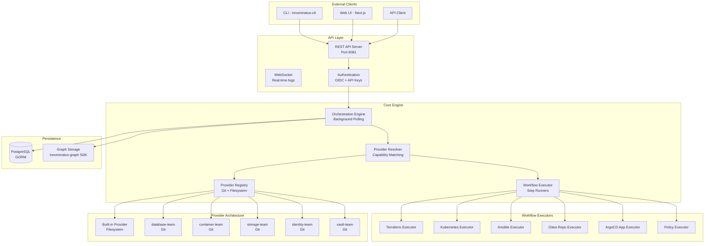
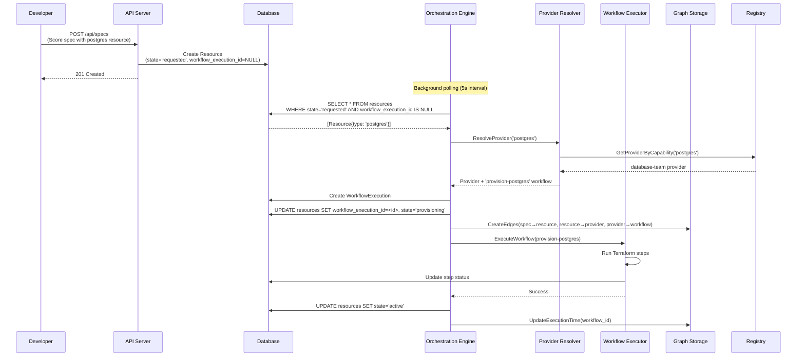
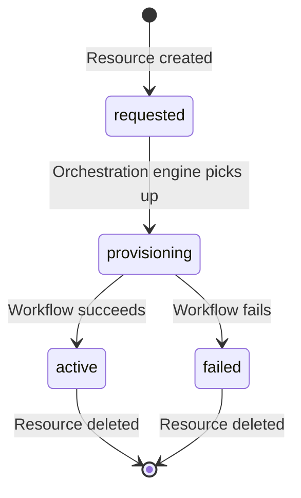
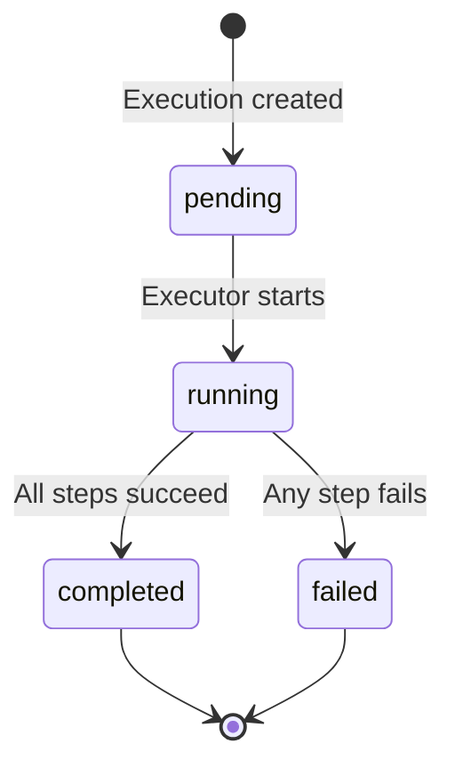
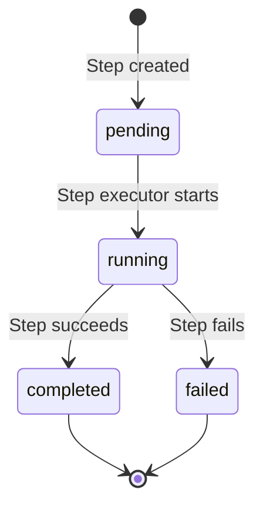

# innominatus Architecture

## System Overview

innominatus is a score-based platform orchestration engine for enterprise Internal Developer Platforms (IDP). It provides event-driven, provider-based automation for multi-step infrastructure and application workflows.



## Event-Driven Orchestration Flow

### Automatic Resource Provisioning



### Key Components

1. **Background Polling (internal/orchestration/engine.go:126)**
   - Polls every 5 seconds for pending resources
   - Query: `state='requested' AND workflow_execution_id IS NULL`
   - Batch size: 100 resources per poll
   - Updates resource state through lifecycle

2. **Provider Resolution (internal/orchestration/resolver.go:41)**
   - Maps resource types → providers via capabilities
   - Validates no duplicate capability claims at startup
   - Returns first provisioner workflow from matched provider
   - Errors on unknown resource types

3. **Workflow Execution (internal/workflow/executor.go:89)**
   - Loads YAML workflow definitions
   - Executes steps sequentially
   - Creates graph nodes and edges
   - Updates database in real-time

## Provider Resolution Algorithm

```go
// Pseudocode
func ResolveProvider(resourceType string) (Provider, Workflow, error) {
    // 1. Find provider claiming this resource type
    provider := registry.FindByCapability(resourceType)
    if provider == nil {
        return nil, nil, ErrUnknownResourceType
    }

    // 2. Get first provisioner workflow
    workflow := provider.GetProvisionerWorkflows()[0]
    if workflow == nil {
        return nil, nil, ErrNoProvisionerWorkflow
    }

    return provider, workflow, nil
}
```

### Capability Conflict Detection

At startup, the system validates that no two providers claim the same resource type:

```go
// internal/providers/loader.go:98
func (l *Loader) validateCapabilities() error {
    capabilityMap := make(map[string][]string) // resourceType → []providerNames

    for _, provider := range l.providers {
        for _, resType := range provider.Capabilities.ResourceTypes {
            capabilityMap[resType] = append(capabilityMap[resType], provider.Name)
        }
    }

    for resType, providers := range capabilityMap {
        if len(providers) > 1 {
            return fmt.Errorf("capability conflict: %s claimed by %v", resType, providers)
        }
    }

    return nil
}
```

## Graph Data Model

The system maintains a complete dependency graph using the `innominatus-graph` SDK.

### Node Types

```go
type NodeType string

const (
    NodeTypeSpec     NodeType = "spec"      // Score specification
    NodeTypeResource NodeType = "resource"  // Individual resource
    NodeTypeProvider NodeType = "provider"  // Provider handling resource
    NodeTypeWorkflow NodeType = "workflow"  // Workflow execution
)
```

### Edge Types

```go
type EdgeType string

const (
    EdgeTypeRequires EdgeType = "requires"  // Resource→Provider, Workflow→Resource
    EdgeTypeContains EdgeType = "contains"  // Spec→Resource
)
```

### Graph Structure Example

```
Spec: ecommerce-backend
  ↓ contains
Resource: postgres-db (state: active)
  ↓ requires
Provider: database-team
  ↓ executes
WorkflowExecution: provision-postgres (status: completed)
```

### Timing Fields (migrations/011_add_graph_timing_fields.sql)

```sql
ALTER TABLE graph_nodes ADD COLUMN execution_started_at TIMESTAMPTZ;
ALTER TABLE graph_nodes ADD COLUMN execution_completed_at TIMESTAMPTZ;
ALTER TABLE graph_nodes ADD COLUMN execution_duration_ms INTEGER;
```

## Database Schema (Key Tables)

### Core Tables

```sql
-- Score specifications
CREATE TABLE specs (
    id SERIAL PRIMARY KEY,
    name VARCHAR(255) UNIQUE NOT NULL,
    content JSONB NOT NULL,
    created_at TIMESTAMPTZ DEFAULT NOW(),
    updated_at TIMESTAMPTZ DEFAULT NOW()
);

-- Resources (databases, namespaces, buckets)
CREATE TABLE resources (
    id SERIAL PRIMARY KEY,
    name VARCHAR(255) NOT NULL,
    type VARCHAR(100) NOT NULL,
    spec_name VARCHAR(255) REFERENCES specs(name),
    state VARCHAR(50) DEFAULT 'requested',  -- requested, provisioning, active, failed
    workflow_execution_id INTEGER REFERENCES workflow_executions(id),
    properties JSONB,
    error_message TEXT,
    created_at TIMESTAMPTZ DEFAULT NOW(),
    updated_at TIMESTAMPTZ DEFAULT NOW()
);

-- Workflow executions
CREATE TABLE workflow_executions (
    id SERIAL PRIMARY KEY,
    workflow_name VARCHAR(255) NOT NULL,
    status VARCHAR(50) DEFAULT 'pending',  -- pending, running, completed, failed
    user_id INTEGER REFERENCES users(id),
    started_at TIMESTAMPTZ,
    completed_at TIMESTAMPTZ,
    error_message TEXT,
    inputs JSONB,
    outputs JSONB
);

-- Workflow steps
CREATE TABLE workflow_steps (
    id SERIAL PRIMARY KEY,
    execution_id INTEGER REFERENCES workflow_executions(id) ON DELETE CASCADE,
    name VARCHAR(255) NOT NULL,
    type VARCHAR(50) NOT NULL,  -- terraform, kubernetes, ansible, policy
    status VARCHAR(50) DEFAULT 'pending',
    logs TEXT,
    started_at TIMESTAMPTZ,
    completed_at TIMESTAMPTZ,
    error_message TEXT
);

-- Graph nodes and edges
CREATE TABLE graph_nodes (
    id SERIAL PRIMARY KEY,
    node_type VARCHAR(50) NOT NULL,  -- spec, resource, provider, workflow
    node_id VARCHAR(255) NOT NULL,
    metadata JSONB,
    execution_started_at TIMESTAMPTZ,
    execution_completed_at TIMESTAMPTZ,
    execution_duration_ms INTEGER,
    UNIQUE(node_type, node_id)
);

CREATE TABLE graph_edges (
    id SERIAL PRIMARY KEY,
    source_node_id INTEGER REFERENCES graph_nodes(id) ON DELETE CASCADE,
    target_node_id INTEGER REFERENCES graph_nodes(id) ON DELETE CASCADE,
    edge_type VARCHAR(50) NOT NULL,  -- requires, contains
    metadata JSONB
);
```

## API Layers

### 1. User API (Port 8081, Swagger: /swagger-user)

**Specs:**
- `POST /api/specs` - Submit Score specification
- `GET /api/specs` - List specs
- `GET /api/specs/{name}` - Get spec details
- `DELETE /api/specs/{name}` - Delete spec

**Workflows:**
- `POST /api/workflows/execute` - Execute workflow
- `GET /api/workflows` - List executions
- `GET /api/workflows/{id}` - Get execution details
- `GET /api/workflows/{id}/logs` - Stream logs (SSE)
- `GET /api/workflows/{id}/graph` - Get workflow graph

**Resources:**
- `GET /api/resources` - List resources
- `GET /api/resources/{id}` - Get resource details
- `GET /api/resources/{id}/graph` - Get resource graph

**Providers:**
- `GET /api/providers` - List providers
- `GET /api/providers/{name}` - Get provider details
- `GET /api/providers/{name}/workflows` - List workflows

### 2. Admin API (Port 8081, Swagger: /swagger-admin)

**Provider Management:**
- `POST /api/admin/providers/reload` - Reload providers from Git
- `GET /api/admin/providers/validate` - Validate provider configs

**System Management:**
- `GET /api/admin/health` - Detailed health check
- `GET /api/admin/metrics` - Prometheus metrics
- `POST /api/admin/workflows/cancel/{id}` - Cancel execution

### 3. WebSocket API

**Real-time Logs:**
- `WS /ws/workflows/{id}/logs` - Stream workflow logs in real-time

## State Machines

### Resource Lifecycle



### Workflow Execution



### Workflow Step



## Integration Points

### 1. Terraform Executor (internal/workflow/executors/terraform.go)

**Operations:** init, plan, apply, destroy

**Flow:**
```
1. Create working directory
2. Write Terraform files (main.tf, variables.tf)
3. Run terraform init
4. Run terraform plan
5. Run terraform apply (or destroy)
6. Capture outputs
7. Update database with status
```

### 2. Kubernetes Executor (internal/workflow/executors/kubernetes.go)

**Operations:** create-namespace, apply-manifest, delete-manifest

**Flow:**
```
1. Load kubeconfig
2. Create Kubernetes client
3. Apply YAML manifests (kubectl apply -f)
4. Wait for resources to be ready
5. Capture status
6. Update database
```

### 3. Ansible Executor (internal/workflow/executors/ansible.go)

**Operations:** run-playbook

**Flow:**
```
1. Create inventory file
2. Write playbook YAML
3. Run ansible-playbook
4. Capture output
5. Update database
```

### 4. Gitea Repository Executor (internal/workflow/executors/gitea.go)

**Operations:** create-repo, delete-repo

**Flow:**
```
1. Authenticate with Gitea API
2. Create repository via REST API
3. Set permissions
4. Initialize with README (optional)
5. Return repository URL
```

### 5. ArgoCD Application Executor (internal/workflow/executors/argocd.go)

**Operations:** create-app, sync-app, delete-app

**Flow:**
```
1. Authenticate with ArgoCD API
2. Create Application manifest
3. Submit to ArgoCD
4. Monitor sync status
5. Return application URL
```

### 6. Policy Executor (internal/workflow/executors/policy.go)

**Operations:** validate, enforce

**Flow:**
```
1. Load policy rules (OPA, custom)
2. Evaluate against workflow inputs
3. Return allow/deny decision
4. Log policy evaluation
```

## Security Model

### Authentication

**Development:** File-based (users.yaml)
```yaml
users:
  - username: admin
    password_hash: bcrypt_hash
    role: admin
```

**Production:** OIDC
```
1. User authenticates with IdP (Keycloak)
2. IdP returns ID token + access token
3. innominatus validates token signature
4. Session created with claims
5. API requests authenticated via session cookie
```

**API Keys:**
```
1. User generates API key via Web UI
2. Key stored hashed in database
3. API requests include: Authorization: Bearer <key>
4. Key validated against database
```

### Authorization

**Roles:**
- `admin`: Full access (providers, workflows, specs, resources)
- `developer`: Create specs, execute workflows, view resources
- `viewer`: Read-only access

**RBAC Matrix:**
```
| Action                  | Admin | Developer | Viewer |
|-------------------------|-------|-----------|--------|
| Submit Score spec       | ✅     | ✅         | ❌      |
| Execute workflow        | ✅     | ✅         | ❌      |
| View executions         | ✅     | ✅         | ✅      |
| View resources          | ✅     | ✅         | ✅      |
| Reload providers        | ✅     | ❌         | ❌      |
| Delete resources        | ✅     | ❌         | ❌      |
```

## Observability

### Logging (zerolog)

```go
log.Info().
    Str("workflow_id", id).
    Str("step", stepName).
    Str("status", status).
    Msg("Step completed")
```

### Metrics (Prometheus)

**Exposed:** `/metrics`

**Key Metrics:**
- `innominatus_workflow_executions_total{status="completed|failed"}`
- `innominatus_workflow_duration_seconds{workflow_name}`
- `innominatus_resource_count{type, state}`
- `innominatus_provider_resolution_duration_seconds`
- `http_requests_total{method, path, status}`

### Tracing (OpenTelemetry)

```
Enabled via ENABLE_TRACING=true
Exports to: Jaeger, Zipkin, or OTLP collector
```

## Performance Characteristics

**Orchestration Engine:**
- Poll interval: 5 seconds
- Batch size: 100 resources per poll
- Concurrent workflows: Configurable (default: 10)

**Database:**
- Connection pool: 25 connections
- Index on: `resources(state, workflow_execution_id)` for fast polling
- Index on: `graph_nodes(node_type, node_id)` for graph queries

**API:**
- Rate limiting: 100 req/min per user (configurable)
- Request timeout: 30 seconds
- WebSocket max connections: 1000

---

**Related Docs:**
- [CLAUDE.md](../CLAUDE.md) - Development guide
- [DIGEST.md](../_internal/DIGEST.md) - Quick context
- [QUICKREF.md](../QUICKREF.md) - Command reference
