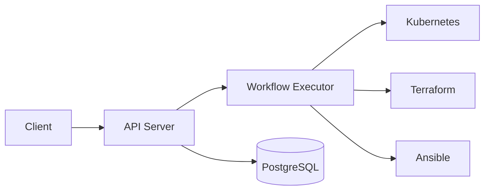

# Architecture

innominatus system architecture.

---

## Overview

---

## Components

- **API Server**: RESTful API endpoints
- **Workflow Executor**: Orchestrates multi-step workflows
- **Database**: PostgreSQL for persistence
- **Executors**: Kubernetes, Terraform, Ansible integrations

---

**More details coming soon...**
