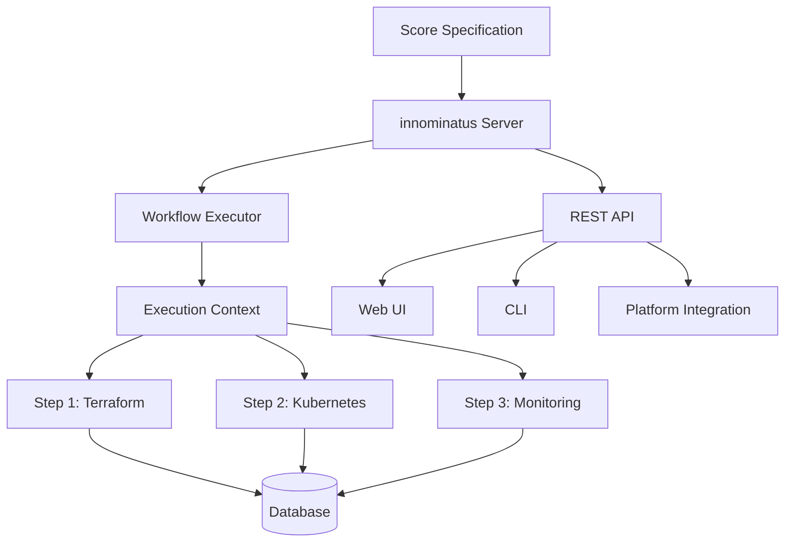
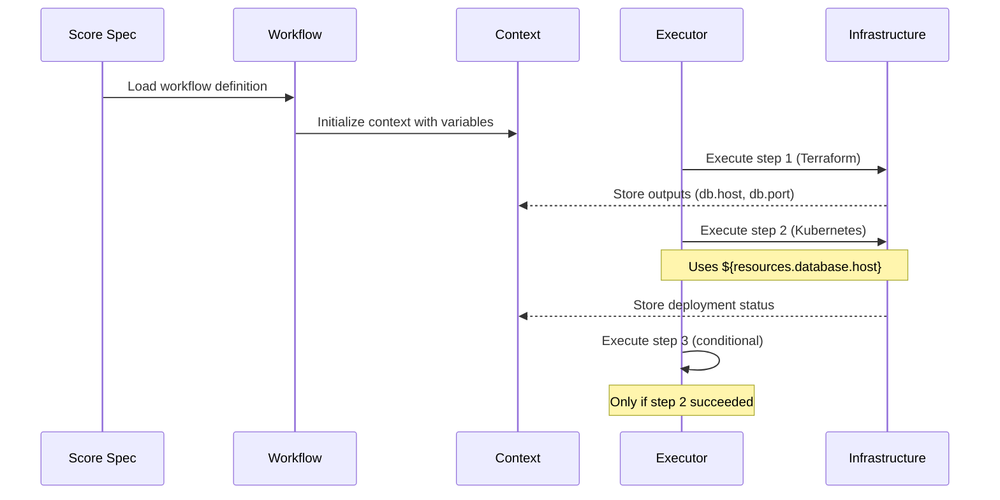

# Core Concepts

Understanding the fundamental concepts of innominatus will help you build powerful platform workflows.

## Architecture Overview



## Key Components

### 1. Score Specifications

Score is a platform-agnostic workload specification format. innominatus extends Score with workflow capabilities.

**Basic Score Spec:**
```yaml
apiVersion: score.dev/v1b1
metadata:
  name: my-app

containers:
  main:
    image: nginx:latest

resources:
  database:
    type: postgres
    params:
      size: small

environment:
  type: kubernetes
```

**Score with Workflows:**
```yaml
apiVersion: score.dev/v1b1
metadata:
  name: my-app

# ... containers and resources ...

workflows:
  deploy:
    steps:
      - name: validate
        type: validation
      - name: provision-db
        type: terraform
        path: ./terraform/postgres
      - name: deploy-app
        type: kubernetes
```

### 2. Workflows

Workflows are multi-step orchestration processes that execute in sequence or parallel.

**Workflow Structure:**
```yaml
workflows:
  workflow-name:
    steps:
      - name: step-1
        type: terraform
        path: ./infrastructure

      - name: step-2
        type: kubernetes
        namespace: production
        when: on_success
```

**Step Types:**
- `terraform` - Infrastructure provisioning
- `kubernetes` - Application deployment
- `ansible` - Configuration management
- `validation` - Validation and checks
- `monitoring` - Observability setup
- `security` - Security scans

### 3. Golden Paths

Golden paths are pre-defined, standardized workflows for common platform patterns.

**Available Golden Paths:**

| Golden Path | Purpose | Use Case |
|------------|---------|----------|
| `deploy-app` | Standard application deployment | Production deployments |
| `ephemeral-env` | Temporary test environments | Feature testing |
| `db-lifecycle` | Database operations | Backups, migrations |
| `observability-setup` | Monitoring setup | Platform observability |

**Using Golden Paths:**
```bash
# Run a golden path
./innominatus-ctl run deploy-app my-app.yaml

# With parameters
./innominatus-ctl run ephemeral-env my-app.yaml \
  --param ttl=4h \
  --param environment_type=staging
```

### 4. Variable Context

The execution context enables data sharing between workflow steps.

**Three Variable Types:**

**1. Workflow Variables** - Configuration and constants
```yaml
variables:
  ENVIRONMENT: production
  REGION: us-east-1

steps:
  - name: deploy
    env:
      ENV: ${workflow.ENVIRONMENT}
```

**2. Step Outputs** - Results from previous steps
```yaml
steps:
  - name: build
    type: validation
    outputFile: /tmp/build.json
    # Outputs: version, image_url

  - name: deploy
    env:
      IMAGE: ${build.image_url}
      VERSION: ${build.version}
```

**3. Resource Outputs** - Infrastructure attributes
```yaml
steps:
  - name: provision-db
    type: terraform
    # Creates resource: database

  - name: deploy
    env:
      DB_HOST: ${resources.database.host}
      DB_PORT: ${resources.database.port}
```

### 5. Conditional Execution

Workflows can adapt based on conditions and previous step results.

**Condition Types:**

**`when` - Simple conditions:**
```yaml
steps:
  - name: deploy-prod
    type: kubernetes
    when: on_success  # only if previous steps succeeded

  - name: rollback
    when: on_failure  # only if any step failed

  - name: cleanup
    when: always      # always run
```

**`if` - Expression evaluation:**
```yaml
steps:
  - name: deploy-prod
    type: kubernetes
    if: ${workflow.ENVIRONMENT} == production

  - name: high-replica-deploy
    if: ${sizing.replicas} >= 5
```

**`unless` - Negative condition:**
```yaml
steps:
  - name: skip-tests
    type: validation
    unless: ${workflow.RUN_TESTS} == true
```

### 6. Parallel Execution

Run independent steps concurrently for faster workflows.

**Parallel Groups:**
```yaml
steps:
  # Group 1 - runs in parallel
  - name: build-frontend
    type: validation
    parallel: true
    parallelGroup: 1

  - name: build-backend
    parallel: true
    parallelGroup: 1

  - name: build-worker
    parallel: true
    parallelGroup: 1

  # Group 2 - runs after group 1 completes
  - name: deploy
    type: kubernetes
    parallelGroup: 2
```

**With Dependencies:**
```yaml
steps:
  - name: provision-db
    type: terraform

  - name: provision-cache
    type: terraform
    parallel: true
    dependsOn: []  # no dependencies, can run immediately

  - name: deploy-app
    type: kubernetes
    dependsOn: [provision-db, provision-cache]
```

### 7. Resources

Resources represent infrastructure components provisioned by workflows.

**Resource Types:**
- `postgres` - PostgreSQL database
- `redis` - Redis cache
- `route` - Ingress/route
- `volume` - Persistent storage
- `vault` - Secrets storage

**Resource Configuration:**
```yaml
resources:
  database:
    type: postgres
    params:
      name: "myapp-db-${workflow.ENVIRONMENT}"
      version: "15"
      size: "db.r5.large"
      backup_retention: 30

  cache:
    type: redis
    params:
      cluster_id: "myapp-cache"
      node_type: "cache.r5.large"
```

### 8. Execution Context

The execution context tracks workflow state and enables step coordination.

**Context Contents:**
- Previous step statuses
- Step outputs
- Resource outputs
- Workflow variables
- Environment variables

**Context Usage in Steps:**
```yaml
steps:
  - name: check-deployment
    type: validation
    if: deploy.success
    env:
      VERSION: ${build.version}
      DB_HOST: ${resources.database.host}
      ENV: ${workflow.ENVIRONMENT}
```

## Data Flow



## Workflow Lifecycle

1. **Validation** - Score spec and workflow validation
2. **Initialization** - Create execution context, set variables
3. **Execution** - Run workflow steps (sequential or parallel)
4. **Capture** - Store step outputs and resource attributes
5. **Conditional Check** - Evaluate conditions for next steps
6. **Completion** - Update status, cleanup resources
7. **Persistence** - Save execution history to database

## Best Practices

### 1. Use Golden Paths for Standard Deployments

```bash
# Good - uses standardized pattern
./innominatus-ctl run deploy-app my-app.yaml

# Less ideal - custom workflow for every app
./innominatus-ctl run my-custom-workflow my-app.yaml
```

### 2. Leverage Variable Context

```yaml
# Good - share data between steps
steps:
  - name: build
    outputFile: /tmp/build.json
  - name: deploy
    env:
      IMAGE: ${build.image_url}

# Less ideal - hardcode values
steps:
  - name: deploy
    env:
      IMAGE: registry.example.com/myapp:latest
```

### 3. Use Resource Syntax for Infrastructure

```yaml
# Good - clear resource reference
env:
  DATABASE_URL: "postgresql://${resources.database.host}:5432/mydb"

# Less clear - step-based reference
env:
  DATABASE_URL: "postgresql://${provision-db.db_host}:5432/mydb"
```

### 4. Implement Conditional Logic

```yaml
# Good - adapt based on environment
steps:
  - name: deploy-prod
    if: ${workflow.ENVIRONMENT} == production
    env:
      REPLICAS: "5"

  - name: deploy-dev
    if: ${workflow.ENVIRONMENT} == development
    env:
      REPLICAS: "1"
```

### 5. Use Parallel Execution

```yaml
# Good - faster execution
steps:
  - name: test-unit
    parallel: true
    parallelGroup: 1

  - name: test-integration
    parallel: true
    parallelGroup: 1

  - name: deploy
    parallelGroup: 2  # after tests

# Slower - sequential execution
steps:
  - name: test-unit
  - name: test-integration
  - name: deploy
```

## Next Steps

- [Create Your First Workflow](first-workflow.md)
- [Explore Golden Paths](../guides/golden-paths.md)
- [Learn Variable Interpolation](../features/context-variables.md)
- [See Real Examples](../examples/basic-workflow.md)
