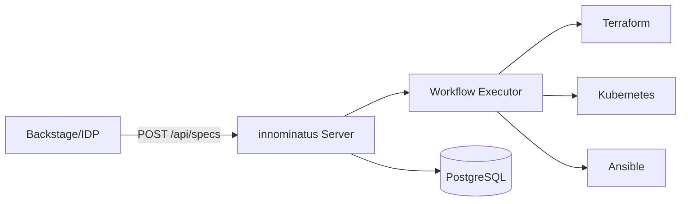

# innominatus Documentation

**Score-based platform orchestration for enterprise Internal Developer Platforms**

> A workflow orchestration component that executes multi-step deployments from Score specifications. Built for platform teams, used by developers.

---

## 👋 Choose Your Path

<table>
<tr>
<td width="50%" valign="top">

### 🧑‍💻 I'm a Developer

**I want to deploy my applications**

Your Platform Team has set up innominatus for you!

**What you need:**
- ✅ Access to your company's innominatus platform
- ✅ API credentials (via SSO or API key)
- ✅ The CLI tool

**Get started:**
→ **[User Guide](user-guide/README.md)** - Deploy your first app in 15 minutes

**Quick Links:**
- [Getting Started](user-guide/getting-started.md) - Connect and deploy
- [Recipes](user-guide/recipes/README.md) - Real-world examples
- [Node.js + PostgreSQL](user-guide/recipes/nodejs-postgres.md) - Production API

</td>
<td width="50%" valign="top">

### ⚙️ I'm a Platform Engineer

**I want to set up innominatus for my organization**

You're building an Internal Developer Platform.

**What you need:**
- ✅ Kubernetes cluster (1.24+)
- ✅ PostgreSQL database (15+)
- ✅ Helm for installation

**Get started:**
→ **[Platform Team Guide](platform-team-guide/README.md)** - Install and operate innominatus

**Quick Links:**
- [Quick Install](platform-team-guide/quick-install.md) - Production-ready in 4 hours
- [Authentication](platform-team-guide/authentication.md) - OIDC/SSO setup
- [Monitoring](platform-team-guide/monitoring.md) - Prometheus & Grafana

</td>
</tr>
</table>

---

## What is innominatus?

innominatus orchestrates complex deployment workflows from [Score specifications](https://score.dev).

**Core Value:**
- **For Platform Teams:** Centralized workflow orchestration with audit trails
- **For Developers:** Self-service deployment via simple Score specs
- **For Organizations:** Standardized golden paths with compliance built-in

## Architecture

innominatus is designed for **enterprise platform integration**:

## Use Cases

### Platform Integration
Integrate with existing IDPs like Backstage, CNOE, or custom platforms via REST API.

### Golden Path Deployment
Use pre-defined workflows for standardized application deployment patterns.

### Multi-Environment Management
Deploy applications across development, staging, and production with environment-specific configuration.

### GitOps Orchestration
Trigger workflows from Git repositories and integrate with ArgoCD.

## Getting Help

- **Documentation**: You're reading it! Browse the guides and references.
- **Examples**: Check out the [examples](examples/basic-workflow.md) directory
- **Issues**: [GitHub Issues](https://github.com/innominatus/innominatus/issues)
- **CLI Help**: Run `./innominatus-ctl --help`

---

## Documentation by Persona

### For Developers (Platform Users)

| Guide | Description |
|-------|-------------|
| [Getting Started](user-guide/getting-started.md) | Connect, install CLI, deploy in 15 minutes |
| [Recipes](user-guide/recipes/README.md) | Real-world deployment examples |
| [CLI Reference](user-guide/cli-reference.md) | Complete command documentation |
| [Troubleshooting](user-guide/troubleshooting.md) | Fix common issues |

### For Platform Teams

| Guide | Description |
|-------|-------------|
| [Quick Install](platform-team-guide/quick-install.md) | Production-ready in 4 hours |
| [Installation](platform-team-guide/installation.md) | Docker, Kubernetes, Helm deployment |
| [Configuration](platform-team-guide/configuration.md) | OIDC, RBAC, secrets management |
| [Monitoring](platform-team-guide/monitoring.md) | Prometheus, Grafana, health checks |
| [Operations](platform-team-guide/operations.md) | Scaling, backup, troubleshooting |

### For Contributors

| Guide | Description |
|-------|-------------|
| [Building](development/building.md) | Build from source |
| [Architecture](development/architecture.md) | System design and components |
| [Testing](development/testing.md) | Test suite and quality assurance |

---

## Key Features

- **Score-Based**: Native support for Score specifications
- **Multi-Step Workflows**: Orchestrate complex deployments with Terraform, Kubernetes, Ansible
- **Golden Paths**: Pre-defined workflows for common platform patterns
- **Variable Context**: Share data between workflow steps with powerful interpolation
- **Conditional Execution**: Dynamic workflows that adapt based on results
- **Parallel Execution**: Run independent steps concurrently for faster deployments
- **API-First**: RESTful API for platform integration
- **Database Persistence**: Track workflow execution history and audit trails
