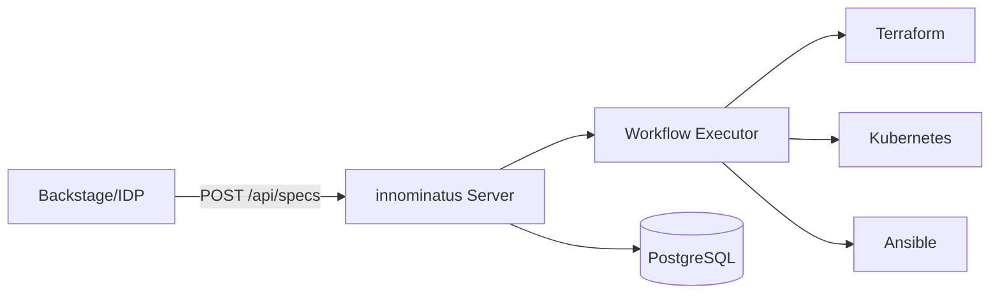

# innominatus Documentation

Welcome to **innominatus** - a Score-based platform orchestration component designed for integration into enterprise Internal Developer Platform (IDP) ecosystems.

## What is innominatus?

innominatus provides centralized execution of multi-step workflows from Score specifications with database persistence and RESTful API integration. It acts as the orchestration layer in your IDP, handling everything from infrastructure provisioning to application deployment.

## Key Features

- **Score-Based**: Native support for Score specifications
- **Multi-Step Workflows**: Orchestrate complex deployments with Terraform, Kubernetes, Ansible
- **Golden Paths**: Pre-defined workflows for common platform patterns
- **Variable Context**: Share data between workflow steps with powerful interpolation
- **Conditional Execution**: Dynamic workflows that adapt based on results
- **Parallel Execution**: Run independent steps concurrently for faster deployments
- **API-First**: RESTful API for platform integration
- **Database Persistence**: Track workflow execution history and audit trails

## Quick Start

```bash
# Start the server
./innominatus

# Deploy an application
./innominatus-ctl run deploy-app score-spec.yaml

# Check status
./innominatus-ctl status my-app
```

[Get Started →](getting-started/quick-start.md){ .md-button .md-button--primary }

## Architecture

innominatus is designed for **enterprise platform integration**:



## Use Cases

### Platform Integration
Integrate with existing IDPs like Backstage, CNOE, or custom platforms via REST API.

### Golden Path Deployment
Use pre-defined workflows for standardized application deployment patterns.

### Multi-Environment Management
Deploy applications across development, staging, and production with environment-specific configuration.

### GitOps Orchestration
Trigger workflows from Git repositories and integrate with ArgoCD.

## Getting Help

- **Documentation**: You're reading it! Browse the guides and references.
- **Examples**: Check out the [examples](examples/basic-workflow.md) directory
- **Issues**: [GitHub Issues](https://github.com/innominatus/innominatus/issues)
- **CLI Help**: Run `./innominatus-ctl --help`

## Next Steps

<div class="grid cards" markdown>

-   :material-clock-fast:{ .lg .middle } __Quick Start__

    ---

    Get innominatus running in 5 minutes

    [:octicons-arrow-right-24: Quick Start](getting-started/quick-start.md)

-   :material-book-open-variant:{ .lg .middle } __User Guide__

    ---

    Learn about workflows, golden paths, and Score specs

    [:octicons-arrow-right-24: User Guide](guides/workflows.md)

-   :material-api:{ .lg .middle } __API Reference__

    ---

    Integrate innominatus with your platform

    [:octicons-arrow-right-24: API Docs](api/rest-api.md)

-   :material-code-braces:{ .lg .middle } __Examples__

    ---

    Real-world workflow examples

    [:octicons-arrow-right-24: Examples](examples/basic-workflow.md)

</div>
