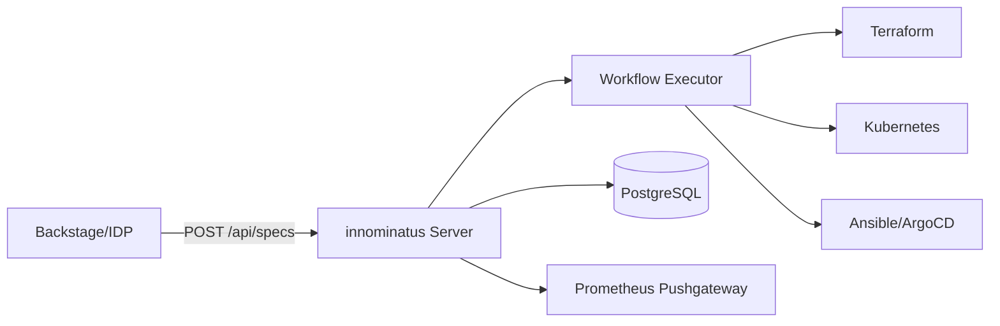

# Platform Team Guide

**Welcome, Platform Engineer!** ⚙️

This guide will help you install, configure, and operate innominatus for your organization.

---

## What is innominatus?

innominatus is a **Score-based platform orchestration component** designed to integrate into your Internal Developer Platform (IDP). It orchestrates complex multi-step workflows for application deployment and infrastructure provisioning.

**Key capabilities:**
- Multi-step workflow execution (Kubernetes, Terraform, Ansible, Git, ArgoCD)
- Database persistence for workflow tracking and audit trails
- RESTful API for platform integration (Backstage, CNOE, custom IDPs)
- OIDC/SSO authentication with API key management
- Prometheus metrics and health monitoring

---

## Prerequisites

Before installing innominatus, ensure you have:

- **Kubernetes cluster** (1.24+)
- **PostgreSQL database** (13+)
- **kubectl** configured with cluster admin access
- **Helm** (3.x) for package management (optional)
- **OIDC provider** (Keycloak, Okta, etc.) for SSO (optional)

---

## Quick Start

### 1. Deploy innominatus

```bash
# Pull Docker image
docker pull ghcr.io/philipsahli/innominatus:latest

# Deploy to Kubernetes
kubectl apply -f deployment.yaml
```

See [Installation Guide](installation.md) for detailed steps.

### 2. Configure Database

```bash
# Create database
createdb -U postgres idp_orchestrator

# Set environment variables
export DB_HOST=postgres.production.internal
export DB_USER=orchestrator_service
export DB_PASSWORD=secure_password
export DB_NAME=idp_orchestrator
```

See [Database Guide](database.md) for production setup.

### 3. Enable OIDC Authentication

```bash
export OIDC_ENABLED=true
export OIDC_ISSUER=https://keycloak.company.com/realms/production
export OIDC_CLIENT_ID=innominatus
export OIDC_CLIENT_SECRET=your-client-secret
```

See [Configuration Guide](configuration.md) for OIDC and RBAC setup.

### 4. Monitor with Prometheus

innominatus exposes metrics at `/metrics`:

```yaml
scrape_configs:
  - job_name: 'innominatus'
    static_configs:
      - targets: ['innominatus.platform.svc.cluster.local:8081']
```

See [Operations Guide](operations.md) for monitoring and scaling.

---

## Documentation

| Guide | Description |
|-------|-------------|
| **[Quick Install](quick-install.md)** | 🚀 Production-ready in 4 hours - recommended starting point |
| **[Installation](installation.md)** | Docker, Kubernetes, Helm deployment (detailed) |
| **[Configuration](configuration.md)** | OIDC, RBAC, secrets management |
| **[Database](database.md)** | PostgreSQL setup and migrations |
| **[Monitoring](monitoring.md)** | Prometheus metrics, Grafana dashboards, health checks |
| **[Authentication](authentication.md)** | OIDC/SSO setup and API key management |
| **[Security](security.md)** | API security and best practices |
| **[Operations](operations.md)** | Scaling, backup, troubleshooting |

---

## Architecture

innominatus is designed for **enterprise platform integration**:



**Components:**
- **Server**: RESTful API, workflow orchestration
- **Database**: PostgreSQL for persistence and audit trails
- **Executors**: Kubernetes, Terraform, Ansible, Git, ArgoCD integration
- **Monitoring**: Prometheus metrics, structured logging

---

## Integration Patterns

### Backstage Software Catalog

```typescript
// Backstage plugin integration
const response = await orchestratorApi.deploySpec(scoreSpec);
console.log('Workflow started:', response.workflow_id);
```

### CNOE Platform

```yaml
# CNOE workflow
steps:
  - name: orchestrate-deployment
    type: http
    config:
      url: "http://innominatus.platform.svc:8081/api/specs"
      method: POST
      body: ${scoreSpecification}
```

### GitOps Webhook

```bash
# Webhook trigger from Git repository
curl -X POST http://innominatus.platform.svc:8081/api/specs \
  -H "Content-Type: application/yaml" \
  --data-binary @applications/my-app/score.yaml
```

---

## Production Checklist

Before going to production:

- [ ] PostgreSQL configured with connection pooling
- [ ] OIDC authentication enabled
- [ ] API keys stored in Kubernetes secrets
- [ ] Network policies configured
- [ ] Prometheus metrics scraping configured
- [ ] Grafana dashboards installed
- [ ] Backup and restore procedures documented
- [ ] High availability with 3+ replicas
- [ ] Resource limits and quotas set
- [ ] Security scanning enabled (gosec, golangci-lint)

---

## Common Tasks

### Deploy innominatus

```bash
kubectl apply -f manifests/deployment.yaml
```

### Update Configuration

```bash
kubectl edit configmap innominatus-config -n platform
kubectl rollout restart deployment innominatus -n platform
```

### Check Logs

```bash
kubectl logs -n platform deployment/innominatus --tail=100 -f
```

### Scale Horizontally

```bash
kubectl scale deployment innominatus -n platform --replicas=5
```

### Backup Database

```bash
pg_dump -h $DB_HOST -U $DB_USER -d idp_orchestrator -F c -f backup.dump
```

---

## Getting Help

- **[Operations Guide](operations.md)** - Troubleshooting and monitoring
- **[GitHub Discussions](https://github.com/philipsahli/innominatus/discussions)** - Community support
- **[GitHub Issues](https://github.com/philipsahli/innominatus/issues)** - Report bugs

---

## Next Steps

**New to innominatus?**
1. **[Quick Install](quick-install.md)** - Get production-ready in 4 hours ⚡
2. **[Authentication](authentication.md)** - Set up OIDC/SSO for your organization
3. **[Monitoring](monitoring.md)** - Configure Prometheus and Grafana
4. **[Operations](operations.md)** - Learn to operate and scale

**Already installed?**
1. **[Configuration](configuration.md)** - Advanced configuration options
2. **[Security](security.md)** - API security and best practices
3. **[Database](database.md)** - Database tuning and optimization

---

**Let's build a great platform!** 🚀
