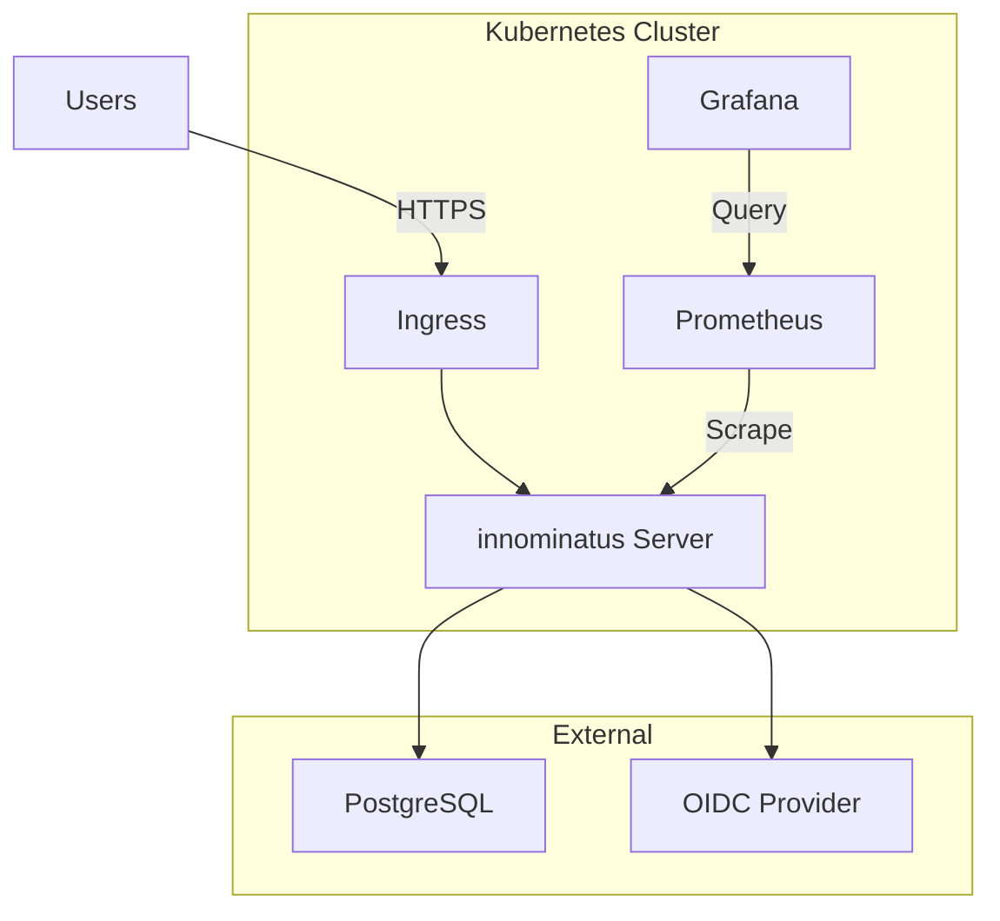

# Quick Install Guide (Production-Ready in 4 Hours)

This guide gets innominatus running in your Kubernetes cluster **production-ready** in 4 hours.

## What You'll Have

After this guide:

✅ innominatus running in Kubernetes (HA setup)
✅ PostgreSQL database (managed or in-cluster)
✅ OIDC authentication
✅ HTTPS ingress with SSL
✅ Monitoring (Prometheus + Grafana)
✅ First user onboarded

**Time budget:** 4 hours

## Prerequisites

Before you start, ensure you have:

**Required:**
- ✅ Kubernetes cluster 1.24+ (EKS, GKE, AKS, or on-prem)
- ✅ `kubectl` configured with admin access
- ✅ Helm 3.12+
- ✅ PostgreSQL 15+ (managed service recommended)
- ✅ SSL certificate for ingress
- ✅ OIDC provider (Okta, Auth0, Keycloak, Google, etc.)

**Nice to have:**
- Prometheus Operator (for monitoring)
- cert-manager (for automatic SSL)
- External DNS (for automatic DNS)

**Skills needed:**
- Kubernetes basics (deployments, services, ingress)
- Helm chart installation
- PostgreSQL connection configuration
- OIDC basics

---

## Architecture Overview



**Components:**
- **innominatus Server** - 3 replicas (HA), autoscaling
- **PostgreSQL** - Managed service (RDS/CloudSQL) or in-cluster
- **OIDC Provider** - Your existing SSO (Okta/Auth0/etc.)
- **Ingress** - NGINX with HTTPS
- **Monitoring** - Prometheus + Grafana

---

## Installation Steps

### Step 1: Prepare Namespace (5 minutes)

```bash
# Create namespace
kubectl create namespace platform

# Set as default
kubectl config set-context --current --namespace=platform
```

### Step 2: Setup PostgreSQL (30 minutes)

**Option A: Managed Service (Recommended)**

```bash
# AWS RDS
aws rds create-db-instance \
  --db-instance-identifier innominatus-db \
  --db-instance-class db.t3.medium \
  --engine postgres \
  --engine-version 15.4 \
  --master-username innominatus \
  --master-user-password <strong-password> \
  --allocated-storage 100 \
  --backup-retention-period 7 \
  --multi-az

# GCP CloudSQL
gcloud sql instances create innominatus-db \
  --database-version=POSTGRES_15 \
  --tier=db-n1-standard-2 \
  --region=us-central1 \
  --backup \
  --enable-bin-log

# Azure Database
az postgres server create \
  --resource-group myResourceGroup \
  --name innominatus-db \
  --location eastus \
  --admin-user innominatus \
  --admin-password <strong-password> \
  --sku-name GP_Gen5_2 \
  --version 15
```

**Option B: In-Cluster (Development/Testing)**

```bash
# Install PostgreSQL with Helm
helm repo add bitnami https://charts.bitnami.com/bitnami
helm install postgres bitnami/postgresql \
  --namespace platform \
  --set auth.username=innominatus \
  --set auth.password=<strong-password> \
  --set auth.database=idp_orchestrator \
  --set primary.persistence.size=50Gi
```

**Create Database:**

```bash
# Connect to PostgreSQL
psql -h <db-host> -U postgres

# Create database and user
CREATE DATABASE idp_orchestrator;
CREATE USER innominatus WITH ENCRYPTED PASSWORD '<password>';
GRANT ALL PRIVILEGES ON DATABASE idp_orchestrator TO innominatus;
```

**Create Kubernetes Secret:**

```bash
kubectl create secret generic innominatus-db \
  --namespace=platform \
  --from-literal=host=<db-host> \
  --from-literal=port=5432 \
  --from-literal=username=innominatus \
  --from-literal=password=<strong-password> \
  --from-literal=database=idp_orchestrator \
  --from-literal=sslmode=require
```

✅ **Checkpoint:** Database is ready

### Step 3: Configure OIDC (20 minutes)

**Example: Okta**

1. Go to Okta Admin → Applications → Create App Integration
2. Choose "OIDC" → "Web Application"
3. Settings:
   - Name: `innominatus`
   - Sign-in redirect URIs: `https://platform.company.com/auth/callback`
   - Sign-out redirect URIs: `https://platform.company.com/`
4. Save → Note:
   - Client ID: `<client-id>`
   - Client Secret: `<client-secret>`
   - Issuer URL: `https://company.okta.com`

**Create Kubernetes Secret:**

```bash
kubectl create secret generic innominatus-oidc \
  --namespace=platform \
  --from-literal=issuer=https://company.okta.com \
  --from-literal=client-id=<client-id> \
  --from-literal=client-secret=<client-secret>
```

✅ **Checkpoint:** OIDC configured

### Step 4: Install innominatus with Helm (15 minutes)

**Add Helm Repository:**

```bash
helm repo add innominatus https://philipsahli.github.io/innominatus
helm repo update
```

**Create `values.yaml`:**

```yaml
# values.yaml - Production Configuration

replicaCount: 3

image:
  repository: ghcr.io/philipsahli/innominatus
  tag: "v1.0.0"
  pullPolicy: IfNotPresent

# Ingress Configuration
ingress:
  enabled: true
  className: nginx
  annotations:
    cert-manager.io/cluster-issuer: letsencrypt-prod
    nginx.ingress.kubernetes.io/ssl-redirect: "true"
  hosts:
    - host: platform.company.com
      paths:
        - path: /
          pathType: Prefix
  tls:
    - secretName: innominatus-tls
      hosts:
        - platform.company.com

# Database Configuration
database:
  existingSecret: innominatus-db
  # Database tables created automatically on startup

# Authentication Configuration
auth:
  type: oidc
  oidc:
    existingSecret: innominatus-oidc
    # Scopes for user info
    scopes:
      - openid
      - profile
      - email
      - groups

# Resource Limits
resources:
  limits:
    cpu: 2000m
    memory: 4Gi
  requests:
    cpu: 500m
    memory: 1Gi

# Auto-scaling
autoscaling:
  enabled: true
  minReplicas: 3
  maxReplicas: 10
  targetCPUUtilization: 70
  targetMemoryUtilization: 80

# Monitoring
monitoring:
  prometheus:
    enabled: true
    serviceMonitor:
      enabled: true
      interval: 30s

  grafana:
    dashboards:
      enabled: true

# Health Checks
livenessProbe:
  httpGet:
    path: /health
    port: 8081
  initialDelaySeconds: 30
  periodSeconds: 10

readinessProbe:
  httpGet:
    path: /ready
    port: 8081
  initialDelaySeconds: 5
  periodSeconds: 5
```

**Install:**

```bash
helm install innominatus innominatus/innominatus \
  --namespace platform \
  --values values.yaml \
  --wait
```

**Verify Installation:**

```bash
# Check pods
kubectl get pods -n platform

# Expected output:
# NAME                          READY   STATUS    RESTARTS   AGE
# innominatus-5d8f9c7b6-abc12   1/1     Running   0          2m
# innominatus-5d8f9c7b6-def34   1/1     Running   0          2m
# innominatus-5d8f9c7b6-ghi56   1/1     Running   0          2m

# Check service
kubectl get svc -n platform

# Check ingress
kubectl get ingress -n platform

# Test health endpoint
curl https://platform.company.com/health
# Expected: {"status":"healthy"}
```

✅ **Checkpoint:** innominatus is running

### Step 5: Setup Monitoring (30 minutes)

**Install Prometheus (if not already installed):**

```bash
# Using Prometheus Operator
helm repo add prometheus-community https://prometheus-community.github.io/helm-charts
helm install prometheus prometheus-community/kube-prometheus-stack \
  --namespace monitoring \
  --create-namespace
```

**Install Grafana Dashboards:**

```bash
# innominatus provides default dashboards
kubectl apply -f https://raw.githubusercontent.com/philipsahli/innominatus/main/monitoring/grafana-dashboards.yaml
```

**Access Grafana:**

```bash
# Port-forward Grafana
kubectl port-forward -n monitoring svc/prometheus-grafana 3000:80

# Open: http://localhost:3000
# Login: admin / prom-operator
```

**Import innominatus Dashboard:**
1. Go to Dashboards → Import
2. Dashboard ID: `innominatus-platform`
3. Select Prometheus datasource
4. Import

✅ **Checkpoint:** Monitoring is configured

### Step 6: Configure Alerts (15 minutes)

**Create AlertManager Configuration:**

```yaml
# alerts.yaml
apiVersion: v1
kind: ConfigMap
metadata:
  name: innominatus-alerts
  namespace: platform
data:
  alerts.yaml: |
    groups:
    - name: innominatus
      interval: 30s
      rules:
      - alert: InnominatusDown
        expr: up{job="innominatus"} == 0
        for: 5m
        labels:
          severity: critical
        annotations:
          summary: innominatus is down

      - alert: HighErrorRate
        expr: rate(http_requests_total{status=~"5.."}[5m]) > 0.05
        for: 5m
        labels:
          severity: warning
        annotations:
          summary: High error rate (>5%)

      - alert: SlowResponseTime
        expr: histogram_quantile(0.95, rate(http_request_duration_seconds_bucket[5m])) > 1
        for: 5m
        labels:
          severity: warning
        annotations:
          summary: Slow response time (p95 > 1s)
```

```bash
kubectl apply -f alerts.yaml
```

**Configure Slack Notifications:**

```yaml
# alertmanager-config.yaml
apiVersion: v1
kind: Secret
metadata:
  name: alertmanager-config
  namespace: monitoring
stringData:
  alertmanager.yaml: |
    global:
      slack_api_url: 'https://hooks.slack.com/services/YOUR/SLACK/WEBHOOK'

    route:
      receiver: 'slack-notifications'
      group_by: ['alertname', 'severity']
      group_wait: 30s
      group_interval: 5m
      repeat_interval: 12h

    receivers:
    - name: 'slack-notifications'
      slack_configs:
      - channel: '#platform-alerts'
        title: '{{ .GroupLabels.alertname }}'
        text: '{{ range .Alerts }}{{ .Annotations.summary }}{{ end }}'
```

```bash
kubectl apply -f alertmanager-config.yaml
```

✅ **Checkpoint:** Alerts are configured

### Step 7: Onboard First User (10 minutes)

**Create Admin User:**

Option A: Via OIDC (Automatic)
- Users from your OIDC provider are automatically created on first login

Option B: Via CLI (Manual)
```bash
# Port-forward to innominatus
kubectl port-forward -n platform svc/innominatus 8081:8081

# Create admin user
innominatus-ctl admin add-user \
  --username admin \
  --email admin@company.com \
  --role admin \
  --team platform

# Generate API key
innominatus-ctl admin generate-api-key \
  --user admin \
  --name admin-key \
  --expiry 90d
```

**Test Access:**

```bash
export IDP_API_KEY="<api-key-from-above>"

# Test connection
innominatus-ctl --server https://platform.company.com ping

# List golden paths
innominatus-ctl --server https://platform.company.com list-goldenpaths
```

✅ **Checkpoint:** First user can access platform

---

## Post-Installation Checklist

### Security Hardening

```bash
# 1. Enable Network Policies
kubectl apply -f - <<EOF
apiVersion: networking.k8s.io/v1
kind: NetworkPolicy
metadata:
  name: innominatus-network-policy
  namespace: platform
spec:
  podSelector:
    matchLabels:
      app: innominatus
  policyTypes:
  - Ingress
  - Egress
  ingress:
  - from:
    - namespaceSelector:
        matchLabels:
          name: ingress-nginx
    ports:
    - protocol: TCP
      port: 8081
  egress:
  - to:
    - namespaceSelector:
        matchLabels:
          name: platform
    ports:
    - protocol: TCP
      port: 5432  # PostgreSQL
EOF

# 2. Enable Pod Security Standards
kubectl label namespace platform pod-security.kubernetes.io/enforce=restricted

# 3. Enable Audit Logging
# (varies by Kubernetes provider - see docs)
```

### Backup Configuration

```bash
# 1. Database Backups (automated)
# RDS/CloudSQL have automated backups enabled

# 2. Workflow State Backup
kubectl apply -f - <<EOF
apiVersion: batch/v1
kind: CronJob
metadata:
  name: innominatus-backup
  namespace: platform
spec:
  schedule: "0 2 * * *"  # Daily at 2 AM
  jobTemplate:
    spec:
      template:
        spec:
          containers:
          - name: backup
            image: postgres:15-alpine
            command:
            - sh
            - -c
            - |
              pg_dump \$DATABASE_URL > /backup/innominatus-\$(date +%Y%m%d).sql
              # Upload to S3/GCS/Azure Blob
            envFrom:
            - secretRef:
                name: innominatus-db
          restartPolicy: OnFailure
EOF
```

### Documentation for Users

Create internal documentation for your developers:

```bash
# 1. Clone template
git clone https://github.com/philipsahli/innominatus-user-docs-template
cd innominatus-user-docs-template

# 2. Customize for your company
sed -i 's/platform.company.com/platform.yourcompany.com/g' docs/*.md
sed -i 's/#platform-support/#your-slack-channel/g' docs/*.md

# 3. Publish to internal wiki/docs
# (copy to Confluence, Notion, GitHub Wiki, etc.)
```

**Template includes:**
- Getting Started guide
- Your company's platform URL
- How to get credentials
- Example deployments
- Troubleshooting
- Support contacts

### User Onboarding

```bash
# 1. Create Slack channel
#platform-support - for user questions
#platform-alerts - for monitoring alerts

# 2. Send announcement
# Subject: "New Platform: Deploy Apps with innominatus"
# Body: See docs/user-onboarding-email-template.md

# 3. Schedule office hours
# Weekly: Tuesday 2-4 PM for Q&A

# 4. Create training materials
# - Video: "Deploy your first app" (10 min)
# - Slides: "Platform overview" (20 slides)
# - Hands-on workshop: "Deploy real app" (1 hour)
```

---

## Verification & Testing

### Smoke Test (End-to-End)

```bash
# 1. Create test app
cat > test-app.yaml <<EOF
apiVersion: score.dev/v1b1
metadata:
  name: platform-test

containers:
  web:
    image: nginx:latest
    ports:
      - name: http
        port: 80

resources:
  route:
    type: route
    params:
      host: test.company.com
      port: 80
EOF

# 2. Deploy test app
innominatus-ctl deploy test-app.yaml

# 3. Wait for deployment
innominatus-ctl status platform-test

# 4. Test access
curl https://test.company.com

# 5. Cleanup
innominatus-ctl delete platform-test
```

### Performance Test

```bash
# Load test with 100 concurrent deployments
for i in {1..100}; do
  innominatus-ctl deploy test-app-$i.yaml &
done
wait

# Check platform performance
innominatus-ctl metrics
```

### Disaster Recovery Test

```bash
# 1. Take snapshot of current state
kubectl get all -n platform > platform-snapshot.yaml

# 2. Simulate failure (delete pod)
kubectl delete pod innominatus-xxxxx -n platform

# 3. Verify auto-recovery
kubectl get pods -n platform
# New pod should be created automatically

# 4. Verify data persistence
innominatus-ctl list
# All apps should still be listed
```

---

## Next Steps

🎉 **Congratulations!** innominatus is production-ready!

**What's running:**
- ✅ innominatus server (3 replicas, HA)
- ✅ PostgreSQL database (managed)
- ✅ OIDC authentication
- ✅ HTTPS ingress
- ✅ Prometheus monitoring
- ✅ Grafana dashboards
- ✅ AlertManager notifications
- ✅ Automated backups

**Time spent:** ~4 hours ✓

### Recommended Next Steps

**Week 1: Onboard Pilot Team**
- Select 1-2 friendly teams (5-10 developers)
- Schedule training session (1 hour)
- Help them deploy first apps
- Collect feedback

**Week 2-4: Iteration**
- Fix issues found by pilot team
- Create company-specific golden paths
- Document common patterns
- Add custom resource types

**Month 2: General Availability**
- Announce to all engineering teams
- Schedule company-wide demo
- Create self-service portal
- Set up support rotation

### Advanced Configuration

**Custom Golden Paths:**
→ [Creating Golden Paths](./golden-paths.md)

**Multi-Environment Setup:**
→ [Environment Configuration](./environments.md)

**Cost Management:**
→ [Resource Quotas & Limits](./cost-management.md)

**Compliance:**
→ [Security & Compliance](./security.md)

### Operations

**Daily:**
- Monitor Grafana dashboards
- Check Slack alerts
- Review failed deployments

**Weekly:**
- Review metrics (deployment success rate, avg duration)
- Check database size/performance
- Update documentation

**Monthly:**
- Upgrade innominatus (helm upgrade)
- Review user feedback
- Optimize resource usage

### Support

**Platform Team:**
- [Operations Guide](./operations.md)
- [Troubleshooting](./troubleshooting.md)
- [GitHub Issues](https://github.com/philipsahli/innominatus/issues)

**Community:**
- [Slack Community](https://innominatus.slack.com)
- [GitHub Discussions](https://github.com/philipsahli/innominatus/discussions)

---

**Installation complete!** 🚀

**Time to first user deployment:** 4 hours ✓
**Production-ready:** ✓
**Monitoring enabled:** ✓
**Ready to scale:** ✓
