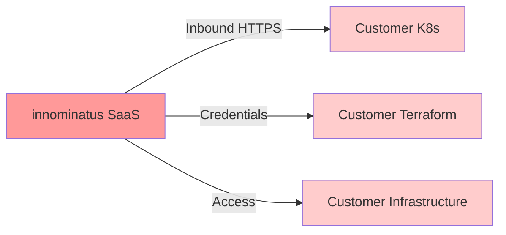
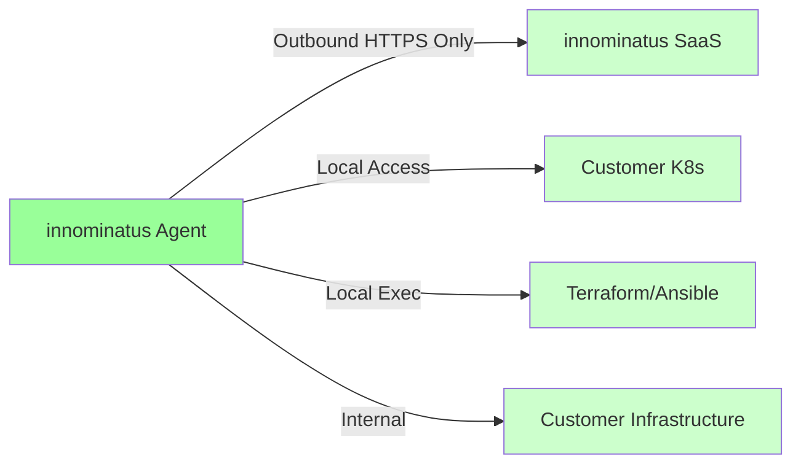
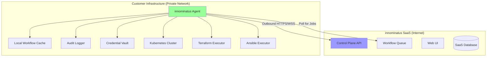
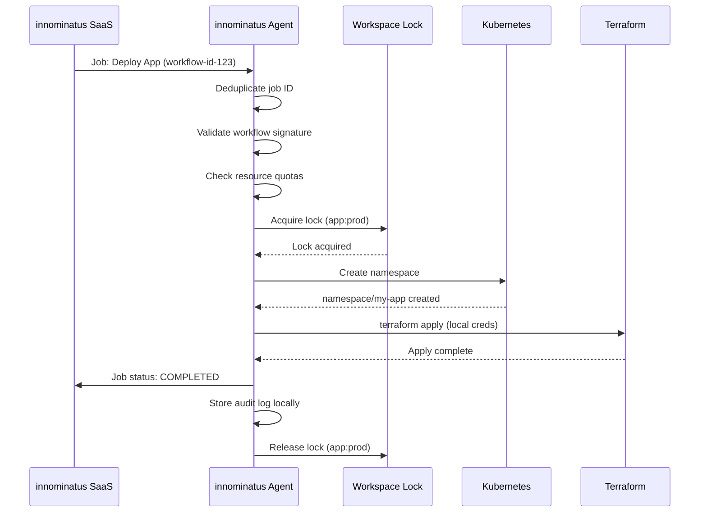
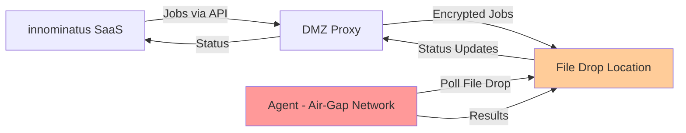
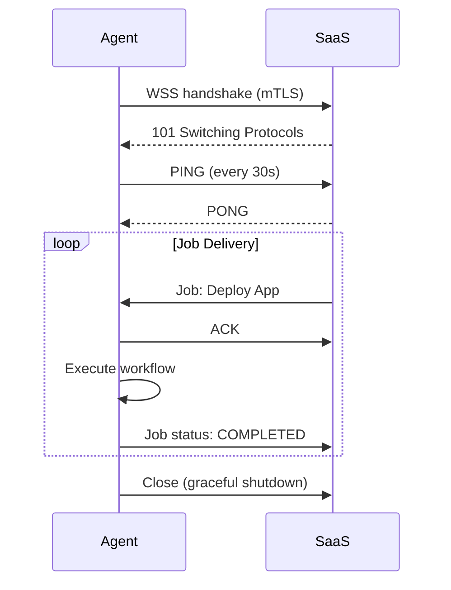
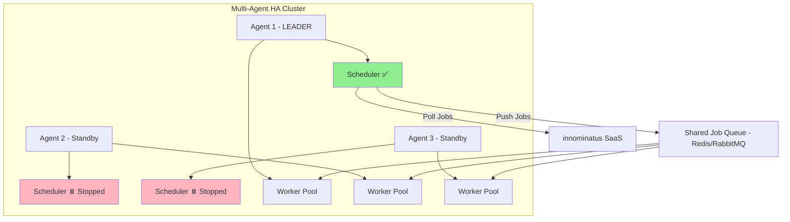

# SaaS Agent Architecture for Enterprise Deployment

**Date:** 2025-10-06
**Status:** Draft - Architecture Proposal
**Target:** Enterprise customers with strict network security requirements

---

## Executive Summary

When running innominatus as a SaaS platform, enterprise customers often have strict network security policies that prohibit:
- Inbound connections from the internet to their infrastructure
- Direct outbound connections to external SaaS platforms
- Exposure of internal Kubernetes clusters to public networks
- Sharing of credentials or infrastructure details with external systems

This document proposes an **agent-based architecture** where a lightweight agent runs within the customer's infrastructure, establishing outbound-only connections to the innominatus SaaS platform while maintaining complete control over their internal resources.

---

## Problem Statement

### Current Architecture (Direct API)



**Issues:**
- ❌ Requires inbound firewall rules to customer infrastructure
- ❌ SaaS platform needs direct access to Kubernetes clusters
- ❌ Credentials must be shared with external SaaS
- ❌ No air-gap deployment possible
- ❌ Difficult to audit and control data flow

### Proposed Architecture (Agent-Based)



**Benefits:**
- ✅ Outbound-only connections (customer firewall friendly)
- ✅ No inbound firewall rules required
- ✅ Credentials never leave customer infrastructure
- ✅ Full customer control over execution
- ✅ Air-gap deployment possible (polling mode)
- ✅ Comprehensive audit logging

---

## Security Risks & Concerns

### Risk 1: Credential Exposure
**Concern:** Sharing Kubernetes credentials, cloud provider keys, and Terraform state with external SaaS platform.

**Impact:**
- High risk of credential leakage
- Compliance violations (SOC 2, ISO 27001, PCI-DSS)
- Reduced control over infrastructure access

**Mitigation:** Agent runs within customer infrastructure with local credential access only.

---

### Risk 2: Network Boundary Violations
**Concern:** Allowing inbound connections from internet to production infrastructure.

**Impact:**
- Firewall rule changes requiring security review
- Increased attack surface
- Potential for unauthorized access
- Compliance violations for regulated industries

**Mitigation:** Agent establishes outbound-only connections via HTTPS/WSS on port 443.

---

### Risk 3: Data Sovereignty
**Concern:** Workflow execution logs, application metadata, and infrastructure details transmitted to external SaaS.

**Impact:**
- GDPR/data residency violations
- Intellectual property exposure
- Compliance audit failures

**Mitigation:**
- Agent executes workflows locally
- Only workflow status and metadata sent to SaaS
- Customer-controlled data retention policies
- Option for full air-gap deployment

---

### Risk 4: Lack of Auditability
**Concern:** Difficult to audit what actions the SaaS platform takes on customer infrastructure.

**Impact:**
- Compliance failures
- Difficult incident investigation
- Reduced trust

**Mitigation:**
- Agent logs all actions locally
- Customer-controlled audit log retention
- Immutable audit trails with checksums
- Integration with SIEM systems

---

### Risk 5: Service Availability Dependency
**Concern:** Customer workflows depend on external SaaS availability.

**Impact:**
- Production deployments blocked during SaaS outages
- Reduced operational resilience
- SLA violations

**Mitigation:**
- Agent can operate in degraded mode (cached workflows)
- Local workflow execution continues during SaaS outages
- Graceful fallback mechanisms

---

### Risk 6: Concurrency & Race Conditions
**Concern:** Multiple concurrent workflow executions causing resource conflicts, state corruption, and data races.

**Impact:**
- **Resource Conflicts:** Multiple workflows modifying same Terraform state simultaneously
- **Database Deadlocks:** Concurrent updates to workflow status in local cache
- **File System Races:** Parallel jobs writing to same workspace directories
- **Network Exhaustion:** Too many concurrent connections to SaaS platform
- **Memory Pressure:** Unbounded goroutines causing OOM kills
- **State Corruption:** Race conditions in workflow cache updates
- **Job Duplication:** Same job executed multiple times due to retry logic
- **⚠️ CRITICAL: Scheduler Duplication** - Multiple agents polling SaaS causing duplicate job fetches

**Mitigation Strategies:**

#### 6.1 Job-Level Locking
```go
// Per-application workspace locking
type WorkspaceLock struct {
    mu    sync.RWMutex
    locks map[string]*sync.Mutex  // key: "app-name:environment"
}

func (w *WorkspaceLock) Execute(appName, env string, fn func() error) error {
    key := fmt.Sprintf("%s:%s", appName, env)

    w.mu.Lock()
    if w.locks[key] == nil {
        w.locks[key] = &sync.Mutex{}
    }
    lock := w.locks[key]
    w.mu.Unlock()

    lock.Lock()         // Block concurrent executions for same app/env
    defer lock.Unlock()

    return fn()
}
```

#### 6.2 Concurrent Job Limits
```yaml
agent:
  concurrency:
    max_concurrent_jobs: 5               # Maximum parallel workflows
    max_jobs_per_app: 1                  # Prevent app-level conflicts
    max_terraform_concurrent: 2          # Terraform state lock safety
    queue_size: 100                      # Job queue buffer
    backpressure_threshold: 80           # Apply backpressure at 80%
```

#### 6.3 Idempotency & Deduplication
```go
// Job deduplication with distributed lock
type JobDeduplicator struct {
    seen   map[string]time.Time  // job_id -> first_seen
    mu     sync.RWMutex
    ttl    time.Duration
}

func (d *JobDeduplicator) ShouldExecute(jobID string) bool {
    d.mu.Lock()
    defer d.mu.Unlock()

    if firstSeen, exists := d.seen[jobID]; exists {
        if time.Since(firstSeen) < d.ttl {
            log.Warn("Duplicate job detected", "job_id", jobID)
            return false  // Skip duplicate
        }
    }

    d.seen[jobID] = time.Now()
    return true
}
```

#### 6.4 Database Connection Pooling
```go
// SQLite connection pool for workflow cache
db, err := sql.Open("sqlite3", "file:cache.db?cache=shared&mode=rwc")
db.SetMaxOpenConns(1)           // SQLite: single writer
db.SetMaxIdleConns(1)
db.SetConnMaxLifetime(time.Hour)

// PostgreSQL for production (if using DB for job queue)
db.SetMaxOpenConns(25)          // Connection pool size
db.SetMaxIdleConns(5)
db.SetConnMaxIdleTime(5 * time.Minute)
```

#### 6.5 Graceful Shutdown & Job Draining
```go
func (a *Agent) Shutdown(ctx context.Context) error {
    // Stop accepting new jobs
    close(a.jobQueue)

    // Wait for in-flight jobs to complete
    done := make(chan struct{})
    go func() {
        a.wg.Wait()  // Wait for all goroutines
        close(done)
    }()

    select {
    case <-done:
        log.Info("All jobs completed gracefully")
        return nil
    case <-ctx.Done():
        log.Warn("Shutdown timeout - force terminating jobs")
        return ctx.Err()
    }
}
```

#### 6.6 Rate Limiting to SaaS Platform
```go
// Token bucket for outbound API calls
type SaaSRateLimiter struct {
    limiter *rate.Limiter
}

func NewSaaSRateLimiter() *SaaSRateLimiter {
    return &SaaSRateLimiter{
        limiter: rate.NewLimiter(rate.Limit(100), 10), // 100 req/s, burst 10
    }
}

func (r *SaaSRateLimiter) Call(ctx context.Context, fn func() error) error {
    if err := r.limiter.Wait(ctx); err != nil {
        return err
    }
    return fn()
}
```

#### 6.7 Worker Pool Pattern
```go
// Fixed-size worker pool
type WorkerPool struct {
    jobs    chan Job
    results chan Result
    workers int
    wg      sync.WaitGroup
}

func (p *WorkerPool) Start(ctx context.Context) {
    for i := 0; i < p.workers; i++ {
        p.wg.Add(1)
        go p.worker(ctx, i)
    }
}

func (p *WorkerPool) worker(ctx context.Context, id int) {
    defer p.wg.Done()

    for {
        select {
        case job := <-p.jobs:
            result := p.executeJob(job)
            p.results <- result
        case <-ctx.Done():
            return
        }
    }
}
```

---

## Agent Architecture

### Component Overview



---

### Agent Components

#### 1. Control Plane Connector
**Responsibility:** Secure communication with innominatus SaaS platform.

**Features:**
- mTLS authentication with customer-specific certificates
- Long-lived WebSocket connection for real-time job delivery
- HTTP/2 polling fallback for restrictive networks
- Automatic reconnection with exponential backoff
- Connection health monitoring

**Configuration:**
```yaml
control_plane:
  endpoint: https://api.innominatus.io
  tenant_id: customer-uuid
  auth_mode: mtls  # Options: mtls, api_key, oidc
  cert_path: /etc/innominatus/agent.crt
  key_path: /etc/innominatus/agent.key
  reconnect_interval: 5s
  max_backoff: 5m
```

---

#### 2. Workflow Executor
**Responsibility:** Execute workflows locally within customer infrastructure.

**Features:**
- Isolated workspace per application/environment
- Support for Terraform, Ansible, Kubernetes, Helm
- Local credential management (no external exposure)
- Resource limits (CPU/memory quotas)
- Workflow timeout enforcement
- **Concurrency control with workspace locking**
- **Job deduplication and idempotency guarantees**
- **Graceful cancellation and cleanup**

**Concurrency-Safe Workflow Execution Flow:**


**Concurrency Implementation:**
```go
// Workflow executor with concurrency controls
type WorkflowExecutor struct {
    workspaceLock   *WorkspaceLock
    deduplicator    *JobDeduplicator
    semaphore       chan struct{}      // Limit concurrent workflows
    activeJobs      sync.Map           // Track in-flight jobs
}

func (e *WorkflowExecutor) Execute(ctx context.Context, job Job) error {
    // 1. Deduplication check
    if !e.deduplicator.ShouldExecute(job.ID) {
        return ErrDuplicateJob
    }

    // 2. Acquire semaphore (limit concurrent jobs)
    select {
    case e.semaphore <- struct{}{}:
        defer func() { <-e.semaphore }()
    case <-ctx.Done():
        return ctx.Err()
    }

    // 3. Track active job
    e.activeJobs.Store(job.ID, time.Now())
    defer e.activeJobs.Delete(job.ID)

    // 4. Acquire workspace lock (prevent conflicts)
    return e.workspaceLock.Execute(job.AppName, job.Environment, func() error {
        return e.executeWorkflow(ctx, job)
    })
}
```

---

#### 3. Local Workflow Cache
**Responsibility:** Cache workflows for offline execution and validation.

**Features:**
- SQLite database for workflow storage
- Cryptographic signature verification
- Version tracking and rollback capability
- Automatic cache expiry (configurable TTL)
- Offline execution mode

**Cache Schema:**
```sql
CREATE TABLE workflow_cache (
    workflow_id TEXT PRIMARY KEY,
    workflow_name TEXT,
    version TEXT,
    content BLOB,
    signature TEXT,  -- Ed25519 signature from SaaS
    cached_at TIMESTAMP,
    expires_at TIMESTAMP,
    last_used TIMESTAMP
);
```

---

#### 4. Audit Logger
**Responsibility:** Immutable audit trail of all agent actions.

**Features:**
- Structured JSON logging (OpenTelemetry format)
- Cryptographic log integrity (SHA-256 checksums)
- Local log retention (customer-controlled)
- SIEM integration (Splunk, Elastic, Datadog)
- Compliance reporting (SOC 2, ISO 27001)

**Log Entry Example:**
```json
{
  "timestamp": "2025-10-06T14:32:10Z",
  "event_type": "workflow.execution.start",
  "workflow_id": "wf-abc123",
  "workflow_name": "deploy-app",
  "app_name": "my-app",
  "environment": "production",
  "initiated_by": "user@company.com",
  "agent_version": "v1.2.3",
  "checksum": "sha256:abcd1234...",
  "previous_checksum": "sha256:prev5678..."
}
```

---

#### 5. Credential Manager
**Responsibility:** Secure credential handling without external exposure.

**Features:**
- Integration with HashiCorp Vault, AWS Secrets Manager, Azure Key Vault
- Environment variable injection (no disk persistence)
- Automatic credential rotation support
- Kubernetes ServiceAccount token management
- Credential usage auditing

**Configuration:**
```yaml
credentials:
  vault:
    enabled: true
    address: https://vault.internal.company.com
    auth_method: kubernetes
    role: innominatus-agent

  kubernetes:
    use_service_account: true
    kubeconfig_path: /etc/innominatus/kubeconfig

  cloud_providers:
    aws:
      auth_method: irsa  # IAM Roles for Service Accounts
    azure:
      auth_method: workload_identity
    gcp:
      auth_method: workload_identity
```

---

## Deployment Models

### Model 1: Kubernetes Sidecar (Recommended)

**Use Case:** Agent runs as sidecar container alongside application workloads.

**Architecture:**
```yaml
apiVersion: v1
kind: Pod
metadata:
  name: my-app
spec:
  containers:
  - name: app
    image: my-app:v1.0

  - name: innominatus-agent  # Sidecar
    image: ghcr.io/innominatus/agent:v1.0
    env:
    - name: TENANT_ID
      value: customer-uuid
    volumeMounts:
    - name: agent-config
      mountPath: /etc/innominatus
    - name: audit-logs
      mountPath: /var/log/innominatus

  volumes:
  - name: agent-config
    secret:
      secretName: innominatus-agent-config
  - name: audit-logs
    persistentVolumeClaim:
      claimName: innominatus-audit-logs
```

**Pros:**
- ✅ Native Kubernetes integration
- ✅ Automatic scaling with workloads
- ✅ ServiceAccount credential access
- ✅ Network policies for isolation

**Cons:**
- ❌ Resource overhead per pod
- ❌ Requires Kubernetes

---

### Model 2: Standalone Daemon (VM/Bare Metal)

**Use Case:** Agent runs as systemd service on dedicated VM or bare metal server.

**Installation:**
```bash
# Install agent binary
curl -L https://releases.innominatus.io/agent/v1.0/linux-amd64 \
  -o /usr/local/bin/innominatus-agent
chmod +x /usr/local/bin/innominatus-agent

# Create systemd service
cat <<EOF > /etc/systemd/system/innominatus-agent.service
[Unit]
Description=innominatus Agent
After=network.target

[Service]
Type=simple
User=innominatus
ExecStart=/usr/local/bin/innominatus-agent \
  --config /etc/innominatus/agent.yaml
Restart=always
RestartSec=10

[Install]
WantedBy=multi-user.target
EOF

systemctl enable --now innominatus-agent
```

**Pros:**
- ✅ No Kubernetes dependency
- ✅ Centralized agent management
- ✅ Lower resource usage

**Cons:**
- ❌ Manual scaling
- ❌ Single point of failure (requires HA setup)

---

### Model 3: Air-Gap Polling

**Use Case:** Customer with no direct internet access (defense, healthcare, finance).

**Architecture:**


**Workflow:**
1. SaaS writes encrypted job files to S3/SFTP drop location
2. Agent polls drop location via outbound HTTPS (DMZ)
3. Agent downloads encrypted jobs
4. Agent executes workflows locally
5. Agent uploads encrypted results to drop location
6. SaaS reads results and updates dashboard

**Configuration:**
```yaml
air_gap:
  enabled: true
  poll_interval: 30s
  drop_location:
    type: s3  # Options: s3, sftp, azure_blob
    bucket: innominatus-jobs-customer-uuid
    region: us-east-1
    encryption: aes-256-gcm
    signing_key_path: /etc/innominatus/signing-key.pem
```

**Pros:**
- ✅ No direct internet connection required
- ✅ Meets strictest security requirements
- ✅ Regulatory compliance (air-gap mandate)

**Cons:**
- ❌ Higher latency (polling interval)
- ❌ More complex setup
- ❌ Requires DMZ infrastructure

---

## Security Controls

### 1. Mutual TLS (mTLS) Authentication

**Implementation:**
```go
// Agent establishes mTLS connection to SaaS
tlsConfig := &tls.Config{
    Certificates: []tls.Certificate{clientCert},
    RootCAs:      caCertPool,
    MinVersion:   tls.VersionTLS13,
    CipherSuites: []uint16{
        tls.TLS_AES_256_GCM_SHA384,
        tls.TLS_CHACHA20_POLY1305_SHA256,
    },
}

conn, err := tls.Dial("tcp", "api.innominatus.io:443", tlsConfig)
```

**Certificate Rotation:**
- Customer-managed certificate lifecycle
- Automatic certificate renewal via cert-manager (K8s)
- Certificate revocation list (CRL) checking

---

### 2. Workflow Signature Verification

**Purpose:** Prevent execution of tampered or malicious workflows.

**Signing Process (SaaS Side):**
```go
// SaaS signs workflow with Ed25519 private key
signature := ed25519.Sign(privateKey, workflowBytes)

job := Job{
    WorkflowID:  "wf-abc123",
    Workflow:    workflowBytes,
    Signature:   signature,
    PublicKey:   base64(publicKey),
}
```

**Verification (Agent Side):**
```go
// Agent verifies signature before execution
publicKey := job.PublicKeyBytes()
if !ed25519.Verify(publicKey, job.Workflow, job.Signature) {
    return errors.New("workflow signature verification failed")
}

// Execute only if signature valid
executor.Run(job.Workflow)
```

---

### 3. Network Policies (Kubernetes)

**Restrict Agent Network Access:**
```yaml
apiVersion: networking.k8s.io/v1
kind: NetworkPolicy
metadata:
  name: innominatus-agent-policy
spec:
  podSelector:
    matchLabels:
      app: innominatus-agent
  policyTypes:
  - Egress
  - Ingress

  egress:
  # Allow outbound to innominatus SaaS only
  - to:
    - ipBlock:
        cidr: 52.1.2.3/32  # SaaS IP
    ports:
    - protocol: TCP
      port: 443

  # Allow internal Kubernetes API access
  - to:
    - namespaceSelector: {}
    ports:
    - protocol: TCP
      port: 6443

  # Block all other egress

  ingress:
  # Deny all inbound connections
  - from: []
```

---

### 4. Resource Quotas & Limits

**Prevent Resource Exhaustion:**
```yaml
agent:
  resources:
    limits:
      cpu: "2"
      memory: 4Gi
      ephemeral-storage: 10Gi
    requests:
      cpu: "500m"
      memory: 1Gi

  workflow_limits:
    max_concurrent_jobs: 5
    max_job_duration: 1h
    max_workspace_size: 5Gi
    timeout_per_step: 10m
```

---

### 5. API Key Rotation

**Automatic Key Rotation:**
```yaml
api_key_rotation:
  enabled: true
  rotation_interval: 90d
  grace_period: 7d  # Old keys valid during grace period
  notification:
    email: security@company.com
    slack_webhook: https://hooks.slack.com/...
```

**Rotation Process:**
1. Agent generates new API key
2. Registers new key with SaaS
3. Uses new key for authentication
4. Old key remains valid during grace period
5. Old key revoked after grace period
6. Audit log entry created

---

### 6. Audit Logging & SIEM Integration

**OpenTelemetry Integration:**
```yaml
observability:
  logging:
    format: json
    level: info
    output: /var/log/innominatus/audit.log

  otel:
    enabled: true
    endpoint: https://otel-collector.company.com:4317
    service_name: innominatus-agent
    attributes:
      deployment.environment: production
      tenant.id: customer-uuid

  siem:
    splunk:
      enabled: true
      hec_endpoint: https://splunk.company.com:8088
      hec_token_secret: innominatus-splunk-token
      index: innominatus_audit
```

---

## Communication Protocols

### Protocol 1: WebSocket (Real-Time)

**Use Case:** Low-latency job delivery for production deployments.

**Connection Flow:**


**Features:**
- Persistent connection (reduced latency)
- Bi-directional communication
- Automatic reconnection
- Compression (permessage-deflate)

---

### Protocol 2: HTTP/2 Long Polling (Fallback)

**Use Case:** Restrictive corporate firewalls blocking WebSockets.

**Polling Flow:**
```go
// Agent polls for jobs every 10 seconds
for {
    resp, err := client.Get("https://api.innominatus.io/v1/jobs/poll?timeout=30s")
    if err != nil {
        time.Sleep(10 * time.Second)
        continue
    }

    if resp.StatusCode == 200 {
        job := parseJob(resp.Body)
        executor.Execute(job)
    }

    time.Sleep(10 * time.Second)
}
```

**Features:**
- Works through HTTP proxies
- No WebSocket requirement
- Server-side timeout (30s)
- Efficient with HTTP/2 multiplexing

---

### Protocol 3: S3/SFTP File Drop (Air-Gap)

**Use Case:** Zero direct internet connectivity.

**File Format:**
```json
{
  "job_id": "job-abc123",
  "created_at": "2025-10-06T14:32:10Z",
  "expires_at": "2025-10-06T15:32:10Z",
  "workflow_encrypted": "base64-encrypted-data",
  "signature": "ed25519-signature",
  "encryption": {
    "algorithm": "aes-256-gcm",
    "nonce": "base64-nonce"
  }
}
```

**Encryption:**
```go
// Encrypt job with customer's public key (X25519)
sharedSecret := x25519.SharedSecret(saasPrivateKey, customerPublicKey)
encryptedJob := aes256gcm.Encrypt(sharedSecret, jobBytes)

// Sign encrypted payload
signature := ed25519.Sign(saasSigningKey, encryptedJob)
```

---

## Concurrency Patterns & Best Practices

### Pattern 1: Scheduler Singleton (Critical for Job Polling)

**CRITICAL:** When agents poll for jobs from SaaS or file drops, only **ONE scheduler instance** must run to prevent duplicate job fetching.

**Problem Without Singleton:**
```
Agent 1 polls SaaS → Gets Job X → Dispatches to worker
Agent 2 polls SaaS → Gets Job X (duplicate!) → Dispatches to worker
❌ Job X executed twice! (Terraform state corruption, duplicate K8s resources)
```

**Solution: Leader Election Pattern**

```go
// Only the leader agent runs the scheduler
type Agent struct {
    scheduler   *JobScheduler
    isLeader    atomic.Bool
    leaderLock  *resourcelock.LeaseLock
}

func (a *Agent) Start(ctx context.Context) error {
    // Start leader election
    go a.runLeaderElection(ctx)

    // All agents can execute jobs (workers)
    go a.runWorkerPool(ctx)

    <-ctx.Done()
    return nil
}

func (a *Agent) runLeaderElection(ctx context.Context) {
    lock := &resourcelock.LeaseLock{
        LeaseMeta: metav1.ObjectMeta{
            Name:      "innominatus-scheduler-leader",  // Scheduler singleton
            Namespace: "innominatus-system",
        },
        Client: a.k8sClient.CoordinationV1(),
        LockConfig: resourcelock.ResourceLockConfig{
            Identity: a.agentID,  // Unique per agent
        },
    }

    leaderelection.RunOrDie(ctx, leaderelection.LeaderElectionConfig{
        Lock:          lock,
        LeaseDuration: 15 * time.Second,
        RenewDeadline: 10 * time.Second,
        RetryPeriod:   2 * time.Second,
        Callbacks: leaderelection.LeaderCallbacks{
            OnStartedLeading: func(ctx context.Context) {
                log.Info("Elected as scheduler leader", "agent_id", a.agentID)
                a.isLeader.Store(true)
                a.runScheduler(ctx)  // ✅ ONLY ONE SCHEDULER RUNS
            },
            OnStoppedLeading: func() {
                log.Warn("Lost scheduler leadership", "agent_id", a.agentID)
                a.isLeader.Store(false)
                a.scheduler.Stop()  // Stop polling for jobs
            },
            OnNewLeader: func(identity string) {
                log.Info("New scheduler leader elected", "leader_id", identity)
            },
        },
    })
}

func (a *Agent) runScheduler(ctx context.Context) {
    ticker := time.NewTicker(10 * time.Second)
    defer ticker.Stop()

    for {
        select {
        case <-ticker.C:
            // Only leader polls for jobs
            if !a.isLeader.Load() {
                continue
            }

            jobs, err := a.fetchJobsFromSaaS(ctx)
            if err != nil {
                log.Error("Failed to fetch jobs", "error", err)
                continue
            }

            // Distribute jobs to worker pool (all agents)
            for _, job := range jobs {
                a.jobQueue <- job  // Workers on all agents can pick this up
            }

        case <-ctx.Done():
            return
        }
    }
}
```

**Architecture with Scheduler Singleton:**


---

### Pattern 2: Distributed Locking (Per-Job Execution)

Even with scheduler singleton, use distributed locks for **individual job execution** to prevent races.

**Implementation with etcd/Consul:**
```go
import "go.etcd.io/etcd/client/v3/concurrency"

type DistributedLock struct {
    client  *clientv3.Client
    session *concurrency.Session
}

func (d *DistributedLock) ExecuteWithLock(ctx context.Context, key string, fn func() error) error {
    mutex := concurrency.NewMutex(d.session, "/locks/"+key)

    // Acquire distributed lock
    if err := mutex.Lock(ctx); err != nil {
        return fmt.Errorf("failed to acquire lock: %w", err)
    }
    defer mutex.Unlock(ctx)

    // Execute job (only one agent will run this)
    return fn()
}
```

**Usage in Worker:**
```go
func (w *Worker) ExecuteJob(ctx context.Context, job Job) error {
    lockKey := fmt.Sprintf("job:%s", job.ID)

    // Distributed lock across all agents
    return w.distributedLock.ExecuteWithLock(ctx, lockKey, func() error {
        // Only one worker (across all agents) executes this
        return w.executeWorkflow(ctx, job)
    })
}
```

---

### Pattern 2: Circuit Breaker for SaaS Communication

Prevent cascading failures when SaaS platform is degraded.

```go
import "github.com/sony/gobreaker"

type SaaSClient struct {
    cb *gobreaker.CircuitBreaker
}

func NewSaaSClient() *SaaSClient {
    settings := gobreaker.Settings{
        Name:        "innominatus-saas",
        MaxRequests: 3,
        Interval:    10 * time.Second,
        Timeout:     30 * time.Second,
        ReadyToTrip: func(counts gobreaker.Counts) bool {
            failureRatio := float64(counts.TotalFailures) / float64(counts.Requests)
            return counts.Requests >= 3 && failureRatio >= 0.6
        },
        OnStateChange: func(name string, from, to gobreaker.State) {
            log.Warn("Circuit breaker state changed",
                "from", from, "to", to)
            if to == gobreaker.StateOpen {
                // Switch to cached workflow mode
                EnableDegradedMode()
            }
        },
    }

    return &SaaSClient{
        cb: gobreaker.NewCircuitBreaker(settings),
    }
}

func (c *SaaSClient) FetchJob(ctx context.Context) (Job, error) {
    result, err := c.cb.Execute(func() (interface{}, error) {
        return c.httpFetchJob(ctx)
    })

    if err == gobreaker.ErrOpenState {
        // Circuit is open, use cached workflows
        return c.fetchFromCache()
    }

    return result.(Job), err
}
```

---

### Pattern 3: Bulkhead Isolation

Isolate different workflow types to prevent resource exhaustion.

```go
type BulkheadExecutor struct {
    terraformPool   *WorkerPool  // 2 workers
    kubernetesPool  *WorkerPool  // 5 workers
    ansiblePool     *WorkerPool  // 3 workers
}

func (b *BulkheadExecutor) Execute(job Job) error {
    switch job.Type {
    case "terraform":
        return b.terraformPool.Submit(job)
    case "kubernetes":
        return b.kubernetesPool.Submit(job)
    case "ansible":
        return b.ansiblePool.Submit(job)
    default:
        return fmt.Errorf("unknown job type: %s", job.Type)
    }
}
```

**Benefits:**
- Terraform state lock issues don't block Kubernetes deployments
- Resource-intensive Ansible playbooks don't starve other jobs
- Better observability (per-pool metrics)

---

### Pattern 4: Backpressure & Flow Control

Prevent agent overload by applying backpressure.

```go
type JobQueue struct {
    queue       chan Job
    maxSize     int
    currentSize atomic.Int32
    threshold   int  // Apply backpressure at 80%
}

func (q *JobQueue) Enqueue(ctx context.Context, job Job) error {
    current := q.currentSize.Load()

    // Apply backpressure if queue is filling up
    if current >= int32(q.threshold) {
        // Tell SaaS to slow down
        q.notifySaaSBackpressure()

        // Block until queue drains
        select {
        case q.queue <- job:
            q.currentSize.Add(1)
            return nil
        case <-ctx.Done():
            return ctx.Err()
        case <-time.After(30 * time.Second):
            return ErrQueueFull
        }
    }

    // Fast path when queue is healthy
    select {
    case q.queue <- job:
        q.currentSize.Add(1)
        return nil
    case <-ctx.Done():
        return ctx.Err()
    }
}

func (q *JobQueue) notifySaaSBackpressure() {
    // Send backpressure signal to SaaS
    // SaaS will slow down job delivery rate
    http.Post("https://api.innominatus.io/v1/agents/backpressure", ...)
}
```

---

### Pattern 5: Timeout Hierarchies

Implement cascading timeouts to prevent hung workflows.

```go
type TimeoutConfig struct {
    JobTimeout      time.Duration  // 1 hour (entire job)
    StepTimeout     time.Duration  // 10 minutes (per workflow step)
    CommandTimeout  time.Duration  // 5 minutes (per command)
    NetworkTimeout  time.Duration  // 30 seconds (HTTP requests)
}

func (e *WorkflowExecutor) executeWithTimeouts(job Job) error {
    // Job-level timeout (outermost)
    jobCtx, jobCancel := context.WithTimeout(context.Background(), e.config.JobTimeout)
    defer jobCancel()

    for _, step := range job.Workflow.Steps {
        // Step-level timeout
        stepCtx, stepCancel := context.WithTimeout(jobCtx, e.config.StepTimeout)

        switch step.Type {
        case "terraform":
            err := e.runTerraformWithTimeout(stepCtx, step)
        case "kubernetes":
            err := e.runKubernetesWithTimeout(stepCtx, step)
        }

        stepCancel()  // Release resources immediately

        if err == context.DeadlineExceeded {
            return fmt.Errorf("step %s timed out after %v", step.Name, e.config.StepTimeout)
        }
    }

    return nil
}
```

---

### Pattern 6: Graceful Degradation

Handle partial failures without full agent shutdown.

```go
type HealthyComponents struct {
    SaaSConnection    bool
    LocalCache        bool
    KubernetesAccess  bool
    VaultAccess       bool
}

func (a *Agent) CheckHealth() HealthyComponents {
    health := HealthyComponents{}

    // Check each component independently
    health.SaaSConnection = a.checkSaaSConnection()
    health.LocalCache = a.checkLocalCache()
    health.KubernetesAccess = a.checkKubernetes()
    health.VaultAccess = a.checkVault()

    return health
}

func (a *Agent) Execute(job Job) error {
    health := a.CheckHealth()

    // Gracefully degrade based on available components
    if !health.SaaSConnection && health.LocalCache {
        log.Warn("SaaS unreachable, using cached workflows")
        return a.executeFromCache(job)
    }

    if !health.VaultAccess {
        log.Warn("Vault unreachable, using fallback credentials")
        return a.executeWithFallbackCreds(job)
    }

    return a.executeNormally(job)
}
```

---

### Pattern 7: Observability for Concurrency Issues

**Prometheus Metrics:**
```go
var (
    activeJobs = prometheus.NewGauge(prometheus.GaugeOpts{
        Name: "agent_active_jobs",
        Help: "Number of currently executing jobs",
    })

    queueDepth = prometheus.NewGauge(prometheus.GaugeOpts{
        Name: "agent_queue_depth",
        Help: "Number of jobs waiting in queue",
    })

    workspaceLockWaitTime = prometheus.NewHistogram(prometheus.HistogramOpts{
        Name:    "agent_workspace_lock_wait_seconds",
        Help:    "Time spent waiting for workspace lock",
        Buckets: []float64{0.1, 0.5, 1, 5, 10, 30, 60},
    })

    duplicateJobsDetected = prometheus.NewCounter(prometheus.CounterOpts{
        Name: "agent_duplicate_jobs_total",
        Help: "Number of duplicate jobs detected and skipped",
    })
)

func (e *WorkflowExecutor) Execute(ctx context.Context, job Job) error {
    activeJobs.Inc()
    defer activeJobs.Dec()

    start := time.Now()
    err := e.workspaceLock.Execute(job.AppName, job.Environment, func() error {
        workspaceLockWaitTime.Observe(time.Since(start).Seconds())
        return e.executeWorkflow(ctx, job)
    })

    return err
}
```

**Distributed Tracing:**
```go
import "go.opentelemetry.io/otel/trace"

func (e *WorkflowExecutor) Execute(ctx context.Context, job Job) error {
    ctx, span := otel.Tracer("agent").Start(ctx, "workflow.execute",
        trace.WithAttributes(
            attribute.String("job.id", job.ID),
            attribute.String("app.name", job.AppName),
            attribute.String("environment", job.Environment),
        ))
    defer span.End()

    // Trace lock acquisition
    _, lockSpan := otel.Tracer("agent").Start(ctx, "workspace.lock.acquire")
    err := e.workspaceLock.Execute(job.AppName, job.Environment, func() error {
        lockSpan.End()
        return e.executeWorkflow(ctx, job)
    })

    if err != nil {
        span.RecordError(err)
        span.SetStatus(codes.Error, err.Error())
    }

    return err
}
```

---

## Comparison Matrix

| Feature | Direct API Access | Agent-Based | Air-Gap Agent |
|---------|-------------------|-------------|---------------|
| **Network Security** |
| Inbound firewall rules | Required ❌ | Not required ✅ | Not required ✅ |
| Outbound only | No ❌ | Yes ✅ | Yes (DMZ) ✅ |
| Network isolation | Low ❌ | High ✅ | Maximum ✅ |
| **Credential Management** |
| Credentials to SaaS | Required ❌ | Not required ✅ | Not required ✅ |
| Local credential access | No ❌ | Yes ✅ | Yes ✅ |
| Vault integration | Limited ⚠️ | Full ✅ | Full ✅ |
| **Compliance** |
| SOC 2 compliant | Difficult ⚠️ | Easy ✅ | Easy ✅ |
| Data residency | Risk ❌ | Compliant ✅ | Compliant ✅ |
| Audit logging | SaaS only ⚠️ | Local + SaaS ✅ | Local only ✅ |
| **Concurrency & Reliability** |
| Job deduplication | SaaS-side ⚠️ | Agent-side ✅ | Agent-side ✅ |
| Workspace locking | No ❌ | Yes ✅ | Yes ✅ |
| Graceful degradation | No ❌ | Yes ✅ | Yes ✅ |
| Circuit breaker | No ❌ | Yes ✅ | Yes ✅ |
| Multi-agent HA | N/A | Leader election ✅ | Leader election ✅ |
| **Operational** |
| Latency | Low (direct) ✅ | Low (WebSocket) ✅ | Medium (polling) ⚠️ |
| Setup complexity | Low ✅ | Medium ⚠️ | High ❌ |
| Maintenance | SaaS managed ✅ | Customer managed ⚠️ | Customer managed ⚠️ |
| Offline operation | No ❌ | Degraded ⚠️ | Yes ✅ |
| **Cost** |
| Infrastructure | None ✅ | Agent VM/K8s ⚠️ | Agent + DMZ ❌ |
| Licensing | Standard | Standard | Premium |

---

## Implementation Roadmap

### Phase 1: Core Agent (MVP)
**Timeline:** 8 weeks

**Deliverables:**
- [ ] WebSocket client with mTLS authentication
- [ ] Workflow executor (Terraform, Kubernetes, Ansible)
- [ ] Local workflow cache (SQLite)
- [ ] Basic audit logging
- [ ] Kubernetes Deployment manifests
- [ ] Agent CLI (`innominatus-agent`)
- [ ] **Job deduplication mechanism**
- [ ] **Per-workspace locking (prevent conflicts)**
- [ ] **Worker pool with concurrency limits**

**Success Criteria:**
- Agent connects to SaaS securely
- Executes workflows without credential exposure
- Logs all actions locally
- **No duplicate job executions**
- **Concurrent workflows don't conflict**

---

### Phase 2: Advanced Security & Concurrency
**Timeline:** 4 weeks

**Deliverables:**
- [ ] Workflow signature verification (Ed25519)
- [ ] HashiCorp Vault integration
- [ ] AWS/Azure/GCP credential providers
- [ ] Network policy templates
- [ ] Resource quota enforcement
- [ ] API key rotation
- [ ] **Distributed locking (etcd/Consul for multi-agent)**
- [ ] **Circuit breaker for SaaS communication**
- [ ] **Graceful shutdown with job draining**
- [ ] **Backpressure mechanism**

**Success Criteria:**
- Workflow tampering detected and blocked
- Credentials never exposed in logs or network
- Automatic key rotation working
- **Multi-agent deployments prevent duplicate executions**
- **Agent handles SaaS outages gracefully**

---

### Phase 3: Air-Gap Support
**Timeline:** 6 weeks

**Deliverables:**
- [ ] S3/SFTP polling mechanism
- [ ] AES-256-GCM encryption
- [ ] X25519 key exchange
- [ ] Offline workflow execution
- [ ] Result upload queue
- [ ] DMZ deployment guides
- [ ] **Leader election for air-gap HA**
- [ ] **File-based job deduplication**

**Success Criteria:**
- Agent operates without direct internet
- Jobs encrypted end-to-end
- Meets air-gap compliance requirements
- **No duplicate executions in polling mode**

---

### Phase 4: Enterprise Features & Observability
**Timeline:** 6 weeks

**Deliverables:**
- [ ] OpenTelemetry integration
- [ ] Splunk/Elastic SIEM connectors
- [ ] Grafana dashboards for agent metrics
- [ ] Multi-agent orchestration
- [ ] High availability (HA) configuration
- [ ] Automated failover
- [ ] **Concurrency metrics (active jobs, queue depth, lock wait time)**
- [ ] **Distributed tracing for workflow execution**
- [ ] **Bulkhead isolation per workflow type**
- [ ] **Timeout hierarchies (job/step/command levels)**

**Success Criteria:**
- SIEM integration verified
- HA setup with zero downtime
- Multi-region agent deployments
- **Complete observability of concurrency bottlenecks**
- **Race conditions eliminated (verified via stress testing)**

---

## FAQ

### Q1: How does the agent authenticate to the SaaS platform?

**A:** Three authentication methods:

1. **mTLS (Recommended):** Customer-specific X.509 certificates
2. **API Key:** Rotating bearer tokens with SHA-256 hashing
3. **OIDC:** Enterprise SSO integration (Okta, Azure AD, Keycloak)

Customer chooses based on security requirements.

---

### Q2: What happens if the SaaS platform is down?

**A:** Agent operates in **degraded mode**:

- Uses cached workflows (up to 7 days old by default)
- Executes workflows locally without SaaS connection
- Queues status updates for delivery when SaaS recovers
- Alerts customer of SaaS unavailability
- No workflow execution disruption

---

### Q3: Can the agent execute arbitrary code?

**A:** No. Security controls:

- **Workflow signature verification:** Only signed workflows execute
- **Workflow schema validation:** Malformed workflows rejected
- **Resource limits:** CPU/memory quotas enforced
- **Namespace isolation:** Kubernetes RBAC restrictions
- **Audit logging:** All executions logged immutably

Customers can implement additional approval gates (human-in-the-loop).

---

### Q4: How much bandwidth does the agent consume?

**A:** Minimal bandwidth usage:

- **WebSocket connection:** ~1 KB/s (heartbeats)
- **Job delivery:** 10-100 KB per job (workflow definition)
- **Status updates:** ~1 KB per status update
- **Typical daily usage:** <10 MB for 100 deployments

Air-gap mode has higher latency but similar bandwidth.

---

### Q5: Can we run multiple agents for high availability?

**A:** Yes. HA deployment options:

**Option 1: Active-Passive**
- Primary agent handles all jobs
- Secondary agent takes over on failure
- Leader election via Kubernetes Lease

**Option 2: Active-Active (Sharded)**
- Multiple agents with job affinity
- SaaS distributes jobs across agents
- Higher throughput

**Option 3: Multi-Region**
- Agents in multiple data centers
- Geographic job distribution
- Disaster recovery capability

---

### Q6: What data is sent to the SaaS platform?

**A:** Minimal metadata only:

**Sent to SaaS:**
- Workflow execution status (success/failure/in-progress)
- Execution duration and timestamps
- Error messages (sanitized, no secrets)
- Application/environment names
- Agent version and health metrics

**Never sent to SaaS:**
- Kubernetes credentials or kubeconfig
- Cloud provider API keys
- Terraform state files
- Application logs or output
- Infrastructure details (IPs, hostnames)

Customers can implement **data loss prevention (DLP)** policies to further sanitize outbound data.

---

### Q7: How do we update the agent?

**A:** Multiple update strategies:

**Kubernetes:**
```yaml
apiVersion: apps/v1
kind: DaemonSet
metadata:
  name: innominatus-agent
spec:
  updateStrategy:
    type: RollingUpdate
    rollingUpdate:
      maxUnavailable: 1
  template:
    spec:
      containers:
      - name: agent
        image: ghcr.io/innominatus/agent:v1.2.0  # Update version
```

**Standalone (systemd):**
```bash
# Download new version
curl -L https://releases.innominatus.io/agent/v1.2.0/linux-amd64 \
  -o /usr/local/bin/innominatus-agent.new

# Verify signature
gpg --verify innominatus-agent.new.sig

# Replace binary
mv /usr/local/bin/innominatus-agent.new /usr/local/bin/innominatus-agent

# Restart service
systemctl restart innominatus-agent
```

**Auto-update (optional):**
```yaml
agent:
  auto_update:
    enabled: true
    channel: stable  # Options: stable, beta, nightly
    check_interval: 1h
    require_signature: true
```

---

### Q8: How does the agent handle concurrent workflows for the same application?

**A:** Multi-layered concurrency control:

**Workspace Locking:**
- Per-application workspace locks prevent conflicts
- Terraform state lock coordination
- Kubernetes namespace-level isolation

**Job Deduplication:**
- SHA-256 job ID tracking (TTL: 1 hour)
- Prevents duplicate executions from retries
- Works across multi-agent deployments (with distributed lock)

**Concurrency Limits:**
```yaml
agent:
  concurrency:
    max_concurrent_jobs: 5        # Total concurrent workflows
    max_jobs_per_app: 1           # Serialize per application
    max_terraform_concurrent: 2   # Terraform state lock safety
```

**Example Scenario:**
1. Job A arrives: "Deploy app-foo to production"
2. Job B arrives: "Deploy app-foo to production" (duplicate)
3. Job C arrives: "Deploy app-bar to production" (different app)

**Behavior:**
- Job A: Acquires lock for "app-foo:production", executes
- Job B: Detected as duplicate, skipped
- Job C: Acquires lock for "app-bar:production", executes in parallel

---

### Q9: What happens if an agent crashes during workflow execution?

**A:** Multiple recovery mechanisms:

**Job State Persistence:**
```sql
-- Jobs tracked in local SQLite database
CREATE TABLE job_state (
    job_id TEXT PRIMARY KEY,
    app_name TEXT,
    environment TEXT,
    status TEXT,  -- pending, in_progress, completed, failed
    started_at TIMESTAMP,
    last_heartbeat TIMESTAMP,
    workspace_path TEXT
);
```

**Recovery Behavior:**
1. **Agent restarts** → Checks for jobs in "in_progress" state
2. **Stale job detection** → Jobs with heartbeat >5min ago marked as failed
3. **Workspace cleanup** → Incomplete Terraform/Kubernetes resources cleaned
4. **Status update to SaaS** → Notify SaaS of job failure
5. **Retry policy** → SaaS can re-queue job based on retry policy

**Crash Recovery Configuration:**
```yaml
agent:
  recovery:
    enabled: true
    stale_job_threshold: 5m
    cleanup_incomplete_workspaces: true
    notify_saas_on_failure: true
```

---

### Q10: How do we prevent Terraform state lock deadlocks?

**A:** Multi-level deadlock prevention:

**1. Workspace Isolation:**
- Each app/environment gets unique workspace directory
- Terraform backend configured with unique state key
- No cross-workspace state dependencies

**2. Lock Timeout:**
```hcl
# Terraform backend configuration injected by agent
terraform {
  backend "s3" {
    bucket = "innominatus-tfstate"
    key    = "apps/${app_name}/${environment}/terraform.tfstate"

    # Lock configuration
    dynamodb_table = "terraform-locks"
    lock_timeout   = "5m"  # Agent enforces this
  }
}
```

**3. Agent-Level Lock Coordination:**
```go
// Agent prevents concurrent Terraform operations per workspace
func (e *TerraformExecutor) Execute(ctx context.Context, job Job) error {
    lockKey := fmt.Sprintf("%s:%s", job.AppName, job.Environment)

    // Acquire agent-level lock first (prevents backend lock contention)
    if err := e.workspaceLock.Acquire(lockKey); err != nil {
        return fmt.Errorf("workspace locked by another job: %w", err)
    }
    defer e.workspaceLock.Release(lockKey)

    // Now safe to run Terraform (backend lock won't deadlock)
    return e.runTerraform(ctx, job)
}
```

**4. Deadlock Detection:**
- Monitor Terraform lock acquisition time (alert if >1min)
- Metrics: `agent_terraform_lock_wait_seconds` histogram
- Auto-abort if lock acquisition exceeds timeout

---

### Q11: Why must the scheduler run as a singleton?

**A:** To prevent duplicate job fetching and execution.

**Problem Scenario (WITHOUT Singleton):**
```
Time: 10:00:00 - SaaS has Job A in queue
Time: 10:00:01 - Agent 1 polls SaaS → Receives Job A
Time: 10:00:01 - Agent 2 polls SaaS → Receives Job A (duplicate!)
Time: 10:00:02 - Agent 1 starts executing Job A
Time: 10:00:02 - Agent 2 starts executing Job A (duplicate!)

Result: ❌ Job A executed twice
- Terraform creates duplicate resources
- Kubernetes deployments conflict
- Database migrations run twice
- Cost overruns, state corruption
```

**Solution: Leader Election**

Only **ONE agent** runs the scheduler (job poller). Other agents remain standby.

**Components:**
- **Scheduler (Singleton):** Polls SaaS for jobs, pushes to shared queue
- **Workers (Multi-Instance):** All agents execute jobs from shared queue
- **Leader Election:** Kubernetes Lease or etcd for scheduler singleton

**Architecture:**
```
┌─────────────────────────────────────────────────┐
│ Multi-Agent Cluster (3 replicas)                │
├─────────────────────────────────────────────────┤
│ Agent 1 (LEADER)                                │
│   ├── Scheduler ✅ (polling SaaS every 10s)     │
│   └── Worker Pool (5 workers)                   │
├─────────────────────────────────────────────────┤
│ Agent 2 (Standby)                               │
│   ├── Scheduler ⏸️ (stopped, waiting)           │
│   └── Worker Pool (5 workers)                   │
├─────────────────────────────────────────────────┤
│ Agent 3 (Standby)                               │
│   ├── Scheduler ⏸️ (stopped, waiting)           │
│   └── Worker Pool (5 workers)                   │
└─────────────────────────────────────────────────┘
              ↓                    ↓
    [Shared Job Queue]    [innominatus SaaS]
    (Redis/RabbitMQ)
              ↓
   All workers pull jobs
   (distributed across agents)
```

**Failover Behavior:**
1. Agent 1 (leader) crashes
2. Kubernetes Lease expires (15 seconds)
3. Agent 2 wins leader election
4. Agent 2 starts scheduler (resumes polling)
5. **Zero duplicate jobs** during failover

**Key Configuration:**
```yaml
agent:
  scheduler:
    leader_election:
      enabled: true
      lease_duration: 15s
      renew_deadline: 10s
      retry_period: 2s
      resource_name: "innominatus-scheduler-leader"

  workers:
    # Workers run on ALL agents (not singleton)
    pool_size: 5
    queue_backend: redis  # Shared queue
```

---

## Conclusion

The **agent-based architecture** provides a secure, enterprise-friendly deployment model for innominatus SaaS that:

✅ **Eliminates inbound firewall requirements** - Outbound-only connections
✅ **Prevents credential exposure** - Local execution with Vault integration
✅ **Ensures data sovereignty** - Workflows executed within customer infrastructure
✅ **Enables air-gap deployments** - Polling mode for maximum security
✅ **Maintains auditability** - Comprehensive local audit logging
✅ **Supports compliance** - SOC 2, ISO 27001, PCI-DSS, HIPAA ready

This architecture positions innominatus as an **enterprise-grade SaaS platform** capable of serving customers with the strictest security requirements while maintaining the operational benefits of a managed service.

---

## Next Steps

1. **Customer Validation:** Survey enterprise customers on requirements
2. **Prototype Development:** Build MVP agent (Phase 1)
3. **Security Review:** Engage third-party security audit
4. **Documentation:** Agent deployment guides and runbooks
5. **Beta Program:** Pilot with 3-5 enterprise customers
6. **General Availability:** Launch agent-based SaaS offering

---

**Questions or feedback?** Contact: platform-team@innominatus.io

---

*Last Updated: 2025-10-06*
