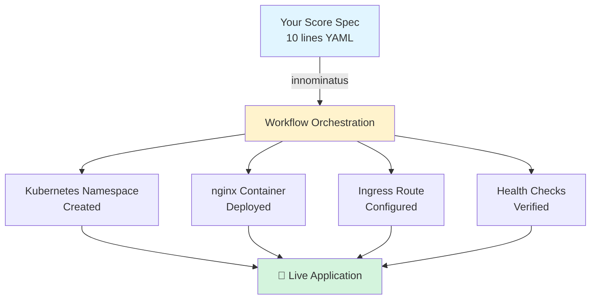

# Getting Started

**Your Platform Team has already set up innominatus for you.** This guide will help you start deploying applications.

**⏱️ Time to Success: 15 minutes**

---

## What You Have

✅ **innominatus Platform**: Running and managed by your Platform Team
✅ **Platform URL**: Ask your Platform Team (usually `https://innominatus.yourcompany.com`)
✅ **Access Control**: OIDC/SSO or API key authentication

---

## Step 1: Get Access (2 minutes)

### Option A: SSO Login (Web UI)

1. Open the innominatus Web UI (get URL from your Platform Team)
2. Click **"Login with SSO"** or **"Login with Keycloak"**
3. Use your company credentials
4. You're in! 🎉

### Option B: API Key (CLI)

1. Log into the Web UI (see Option A)
2. Navigate to **Profile → API Keys**
3. Click **"Generate New Key"**
4. Give it a name (e.g., "my-laptop-cli")
5. **Copy the key** (you won't see it again!)
6. Save it securely

```bash
# Set your API key
export INNOMINATUS_API_KEY="your-api-key-here"

# Or save to config file
echo "api_key: your-api-key-here" > ~/.innominatus/config.yaml
```

---

## Step 2: Install the CLI (2 minutes)

### Option A: Download from Platform Portal (Recommended)

Your Platform Team typically provides a download link:

```bash
# Ask Platform Team for the specific download URL, usually:
curl -L https://platform.company.com/downloads/innominatus-ctl -o innominatus-ctl
chmod +x innominatus-ctl
sudo mv innominatus-ctl /usr/local/bin/
```

### Option B: GitHub Releases

If your Platform Team hasn't set up a portal yet:

```bash
# macOS (Apple Silicon)
curl -L https://github.com/philipsahli/innominatus/releases/latest/download/innominatus-ctl_darwin_arm64.tar.gz -o innominatus-ctl.tar.gz
tar -xzf innominatus-ctl.tar.gz
sudo mv innominatus-ctl /usr/local/bin/

# macOS (Intel)
curl -L https://github.com/philipsahli/innominatus/releases/latest/download/innominatus-ctl_darwin_amd64.tar.gz -o innominatus-ctl.tar.gz

# Linux (AMD64)
curl -L https://github.com/philipsahli/innominatus/releases/latest/download/innominatus-ctl_linux_amd64.tar.gz -o innominatus-ctl.tar.gz

# Windows: Download .zip from releases page
```

### Verify Installation

```bash
innominatus-ctl --version
# Output: innominatus-ctl v1.0.0
```

---

## Step 3: Configure the CLI (1 minute)

Tell the CLI where your innominatus platform is:

```bash
# Set platform URL
export INNOMINATUS_URL="https://innominatus.yourcompany.com"

# Or create config file
mkdir -p ~/.innominatus
cat <<EOF > ~/.innominatus/config.yaml
url: https://innominatus.yourcompany.com
api_key: your-api-key-here
EOF
```

---

## Step 4: Test Your Setup (1 minute)

```bash
# List deployed applications (should return empty list if you haven't deployed anything)
innominatus-ctl list

# Expected output:
# No applications deployed yet
```

If this works, you're ready to deploy! 🚀

---

## Step 5: Your First Deployment (5 minutes)

Create a simple Score specification:

```bash
cat <<EOF > my-first-app.yaml
apiVersion: score.dev/v1b1
metadata:
  name: my-first-app

containers:
  web:
    image: nginx:latest
    ports:
      - port: 80

resources:
  route:
    type: route
    params:
      host: my-first-app.yourcompany.com
EOF
```

Deploy it:

```bash
innominatus-ctl deploy my-first-app.yaml
```

Output:
```
🚀 Starting deployment: my-first-app

Workflow: deploy-app (6 steps)
═══════════════════════════════════════

[1/6] ✓ validate-spec          (0.5s)
      Validating Score specification...
      ✓ Valid Score spec v1b1

[2/6] ✓ create-namespace        (1.2s)
      Creating Kubernetes namespace: my-first-app
      ✓ Namespace created

[3/6] ✓ provision-resources     (2.1s)
      Creating ingress route...
      ✓ Route configured: my-first-app.yourcompany.com

[4/6] ✓ deploy-application      (3.8s)
      Deploying container: nginx:latest
      ✓ Deployment successful

[5/6] ✓ health-check            (2.3s)
      Waiting for pods to be ready...
      ✓ 1/1 pods healthy

[6/6] ✓ register-application    (0.4s)
      Registering with platform...
      ✓ Registered

═══════════════════════════════════════
✅ Deployment completed successfully!
⏱  Total time: 10.3 seconds

🌐 Your application is available at:
   https://my-first-app.yourcompany.com

📊 View status:    innominatus-ctl status my-first-app
📜 View logs:      innominatus-ctl logs my-first-app
🗑️  Delete app:     innominatus-ctl delete my-first-app
```

**🎉 SUCCESS!** Visit the URL and see your app running!

---

## What Just Happened?

innominatus orchestrated multiple platform operations that would normally require manual setup:



**You wrote:** 10 lines of Score specification

**innominatus automated:**
- ✅ Kubernetes namespace creation
- ✅ Deployment manifest generation
- ✅ Ingress/route configuration
- ✅ Health check setup
- ✅ Platform registration

**You didn't need to:**
- ❌ Write Kubernetes YAML (40+ lines saved)
- ❌ Configure kubectl contexts
- ❌ Manage ingress controllers
- ❌ Set up monitoring/health checks

**This is platform orchestration!** 🚀

---

## Common Commands

```bash
# Deploy application
innominatus-ctl deploy my-app.yaml

# Check status
innominatus-ctl status my-first-app

# View logs
innominatus-ctl logs my-first-app

# List all apps
innominatus-ctl list

# Delete app
innominatus-ctl delete my-first-app
```

---

## What's Next?

- **[First Deployment](first-deployment.md)** - Detailed walkthrough with troubleshooting
- **[CLI Reference](cli-reference.md)** - Complete command documentation
- **[Troubleshooting](troubleshooting.md)** - Fix common issues

---

## Getting Help

**Platform Team**: Your first point of contact for any issues
**Self-Service**: [Troubleshooting Guide](troubleshooting.md), CLI `--help`, Platform documentation portal

---

**Happy deploying!** 🚀
