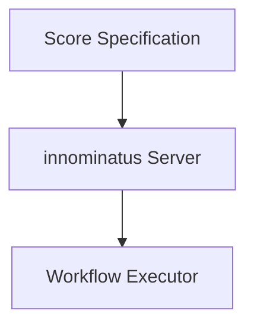

# Fix Mermaid Diagrams in Documentation

## Problem
Mermaid diagrams in the documentation at http://localhost:8081/docs/getting-started/concepts/ are displaying as raw code instead of rendered diagrams.

## Root Cause
The Next.js web-ui doesn't have Mermaid.js initialization code. ReactMarkdown is rendering the mermaid code blocks as plain text/code instead of interactive diagrams.

## Solution

### 1. Install Mermaid Package
```bash
cd web-ui
npm install mermaid
```

### 2. Mermaid Component Already Created
File: `/Users/philipsahli/projects/innominatus/web-ui/src/components/mermaid-diagram.tsx`

This component is ready to use and handles:
- Client-side rendering with 'use client' directive
- Mermaid initialization with proper configuration
- Error handling for invalid diagrams
- Unique IDs for multiple diagrams on same page

### 3. Update DocPageClient Component
File: `/Users/philipsahli/projects/innominatus/web-ui/src/components/DocPageClient.tsx`

Add Mermaid support to the ReactMarkdown code component:

**Import the component (line ~15):**
```typescript
import { MermaidDiagram } from '@/components/mermaid-diagram';
```

**Update the code component handler (around line 104-137):**

Replace the current code block handler to detect `language-mermaid` and render with MermaidDiagram:

```typescript
code({
  inline,
  className,
  children,
  ...props
}: ComponentPropsWithoutRef<'code'> & { inline?: boolean }) {
  const match = /language-(\w+)/.exec(className || '');
  const lang = match ? match[1] : '';

  if (inline) {
    return (
      <code
        className="inline-flex items-center px-2 py-0.5 mx-0.5 rounded bg-indigo-50 dark:bg-indigo-950 text-indigo-700 dark:text-indigo-300 text-sm font-mono border border-indigo-200 dark:border-indigo-800 whitespace-nowrap"
        {...props}
      >
        {children}
      </code>
    );
  }

  // Handle Mermaid diagrams
  if (lang === 'mermaid') {
    return <MermaidDiagram chart={String(children).trim()} />;
  }

  // Handle regular code blocks
  return (
    <div className="relative group my-4 rounded-lg overflow-hidden border border-gray-200 dark:border-gray-700">
      {lang && (
        <div className="absolute top-2 right-2 px-3 py-1 text-xs font-medium text-gray-400 bg-gray-800 rounded z-10">
          {lang}
        </div>
      )}
      <pre className="!my-0 !p-4 overflow-x-auto bg-gray-900 dark:bg-gray-950">
        <code className={className} {...props}>
          {children}
        </code>
      </pre>
    </div>
  );
},
```

### 4. Rebuild and Test
```bash
# Rebuild the web-ui
cd web-ui
npm run build

# No server restart needed - just refresh browser
# Open: http://localhost:8081/docs/getting-started/concepts/
```

## Expected Result
After these changes, Mermaid code blocks like:

````markdown

````

Will render as interactive SVG diagrams instead of plain text code blocks.

## Files Involved
- `/Users/philipsahli/projects/innominatus/web-ui/src/components/mermaid-diagram.tsx` (already created)
- `/Users/philipsahli/projects/innominatus/web-ui/src/components/DocPageClient.tsx` (needs update)
- `/Users/philipsahli/projects/innominatus/web-ui/package.json` (needs mermaid dependency)

## Testing
1. Navigate to http://localhost:8081/docs/getting-started/concepts/
2. Verify the "Architecture Overview" and "Data Flow" diagrams render as SVG graphics
3. Check that code syntax highlighting still works for other languages (yaml, bash, typescript, etc.)
